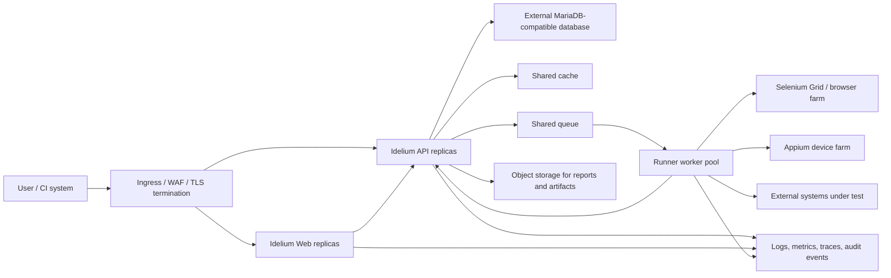

# High-availability reference architecture

This reference architecture describes a production Idelium deployment that
separates the single-node demo profile from a highly available enterprise
profile.

The demo Compose stack remains the fastest local evaluation path. The HA profile
uses managed or externally operated services for persistence, queues, object
storage, ingress, TLS, secrets, and observability.

## Architecture goals

- Keep Web and API replicas stateless.
- Keep customer data isolated by tenant and project authorization.
- Store execution artifacts outside application containers.
- Use least-privilege identities for database, object storage, queue, cache, and
  runner access.
- Preserve deterministic startup, health checks, backup, restore, upgrade, and
  rollback procedures.
- Pin all deployable component versions, image digests, and package versions in
  the release record.

## Logical topology

## Trust boundaries

| Boundary | Allowed traffic | Required control |
| --- | --- | --- |
| Internet to ingress | HTTPS only | WAF rules, TLS policy, rate limits, request size limits. |
| Ingress to Web/API | Internal HTTPS or trusted private network | Service identity, health-based routing, finite timeouts. |
| Web to API | Authenticated API calls | Session/CORS policy, CSRF protection, tenant-aware authorization. |
| API to database | API database identity only | Least privilege, encryption in transit, backup encryption. |
| API to cache/queue | API and worker identities only | Namespace isolation, finite retry/dead-letter behavior. |
| API/runner to object storage | Scoped artifact bucket access | Tenant-aware keys, signed URLs, retention and checksum validation. |
| Runner to execution targets | Explicit allow-list | No default outbound secret exposure; redact request and result logs. |
| Operators to production | Privileged access path | MFA, audit logging, break-glass approval, no shared credentials. |

## Data flows

1. The user reaches Idelium through ingress and authenticates through the Web/API
   boundary.
2. API requests are authorized by tenant, customer, project, and role.
3. Test definitions, environments, plugins, and schedules are stored in the
   database.
4. Execution requests enqueue work instead of binding the API process to a long
   runner session.
5. Runner workers pull queued work, fetch the minimum required configuration,
   execute Selenium, Appium, Postman/Newman, or DSL steps, and submit structured
   results.
6. Reports, screenshots, traces, and larger artifacts are written to object
   storage with checksums and tenant-scoped descriptors.
7. Web result viewers fetch only authorized descriptors and short-lived artifact
   URLs.
8. Logs, metrics, traces, and audit events carry correlation IDs without secrets
   or customer payloads.

## Failure domains

| Failure domain | Expected behavior | Test evidence |
| --- | --- | --- |
| Web replica | Ingress removes unhealthy replica; active sessions continue through another replica. | Web health and reload smoke test. |
| API replica | Ingress removes unhealthy replica; queued work is not lost. | API health, queue retry, idempotent result submission. |
| Database primary | Application enters degraded mode or fails safely; restore or failover procedure starts. | Backup/restore and failover drill. |
| Queue | New executions are rejected or delayed with explicit status; API remains observable. | Queue outage drill and recovery. |
| Cache | API falls back or reports degraded state without corrupting sessions. | Cache outage drill. |
| Object storage | Artifact writes fail explicitly; test result keeps a durable error descriptor. | Artifact write failure drill. |
| Ingress/TLS | Traffic fails closed; no plain HTTP production fallback. | TLS and ingress failover check. |
| Runner pool | Queued jobs remain pending until capacity returns; stuck jobs time out. | Runner termination and autoscaling drill. |
| Browser/mobile farm | Affected executions fail with actionable diagnostics. | Selenium/Appium dependency outage drill. |

## Scaling units

| Unit | Scale signal | Notes |
| --- | --- | --- |
| Web replicas | Request latency, CPU, memory, 5xx rate | Stateless; keep assets immutable per release. |
| API replicas | Request latency, queue submission rate, CPU, database pool saturation | Use connection pool limits and request timeouts. |
| Runner workers | Queue depth, oldest queued job age, execution duration, failure rate | Separate Selenium, Appium, Postman/Newman, and DSL pools when workloads diverge. |
| Database | CPU, IOPS, locks, replication lag, connection count | Prefer managed HA with tested backups and point-in-time restore. |
| Object storage | Write error rate, latency, storage growth, lifecycle transitions | Apply retention and checksum validation. |
| Queue/cache | Throughput, latency, retry/dead-letter count, memory | Configure bounded retries and alerts. |

## Required managed services

- MariaDB-compatible managed database or externally operated clustered database.
- Redis-compatible cache and queue backend, or equivalent managed services.
- Object storage with server-side encryption, retention policy, and access logs.
- Ingress/WAF with TLS certificate automation and HTTP-to-HTTPS enforcement.
- Secrets manager with rotation and per-service identities.
- Centralized observability for logs, metrics, traces, and audit events.
- Backup storage isolated from the application runtime account.

## Capacity and SLO assumptions

Initial enterprise sizing must publish:

- expected concurrent Web users;
- expected concurrent executions by type;
- average and p95 execution duration;
- maximum artifact size and retention period;
- database size growth per project and tenant;
- object storage growth per day;
- queue depth thresholds;
- expected recovery budget.

Recommended baseline targets:

| Target | Baseline |
| --- | --- |
| Web/API availability | 99.9% for the production control plane. |
| API p95 latency | Under 500 ms for non-execution interactive calls. |
| Execution queue acknowledgement | Under 5 seconds during normal load. |
| RPO | 15 minutes or better for database and artifact metadata. |
| RTO | 60 minutes or better for control-plane recovery. |
| Artifact durability | Use object-storage durability guarantees and checksum validation. |

## Production deployment example requirements

Deployment examples must not contain production secrets. They must use:

- image tags or digests recorded in the release train;
- external secret references instead of literal passwords or tokens;
- TLS enabled at ingress and between internal services where required;
- explicit health checks and readiness gates;
- externally configured database, cache, queue, and object storage endpoints;
- least-privilege service identities;
- finite connection, read, queue, and runner timeouts;
- separate namespaces or accounts for demo, staging, and production.

Example placeholders must look like `${IDELIUM_API_IMAGE_DIGEST}` or
`${IDELIUM_DATABASE_SECRET_REF}`. Do not publish real secret values in examples.

## Demo and production profile separation

| Profile | Purpose | Persistence | Secrets | Scaling |
| --- | --- | --- | --- | --- |
| Demo | Local evaluation and screenshots | Local Compose volumes | Safe development defaults only | Single-node. |
| Production HA | Enterprise operation | External managed services | Secret manager references | Horizontally scalable Web/API/runner pools. |

Demo defaults must never be treated as production defaults. Production profiles
must not enable demo users, self-signed public certificates, mounted source code,
debug tooling, or local-only service credentials by default.

## Failure testing checklist

Run these drills before promoting a release train to production:

- stop one Web replica and verify ingress failover;
- stop one API replica and verify health-based routing;
- block database access and verify safe failure plus recovery;
- block queue access and verify explicit pending/degraded status;
- block cache access and verify safe degradation;
- block object storage writes and verify artifact error descriptors;
- terminate runner workers and verify job retry or timeout behavior;
- make Selenium/Appium dependencies unreachable and verify actionable
  diagnostics;
- restore database and artifact metadata from backup in an isolated environment;
- roll back to the previous compatible release or execute the documented
  forward-fix plan.

## Compatibility and release evidence

Every HA release must link:

- the coordinated compatibility matrix;
- the cross-repository contract gate output;
- the supply-chain provenance gate output;
- backup, restore, upgrade, rollback, and failure-drill evidence;
- known capacity limits and SLO assumptions;
- migration and rollback notes;
- security review notes covering tenant isolation, redaction, and least
  privilege.
