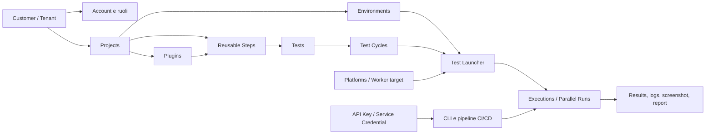

# Idelium Console — Walkthrough funzionale, analisi dei repository e valutazione enterprise

> **Data dell’analisi:** 28 luglio 2026  
> **Destinatari:** utenti tecnici, QA Lead, Automation Architect, DevOps/SRE, Security Team, Product Owner e team enterprise  
> **Ambito:** 22 screenshot della console, tutte le 7 sezioni della wiki `idelium-docker` e i 4 repository descritti nella documentazione  
> **Scopo:** fornire una guida prodotto completa e un backlog tecnico utilizzabile come base per attività di sviluppo

---

## 1. Executive summary

Idelium presenta una **fondazione chiaramente enterprise-oriented**: separazione tra console amministrativa, API, motore di esecuzione e data plane; modello multi-customer; progetti isolati; componenti riutilizzabili; esecuzioni Selenium, Appium e API/Postman; ambienti runtime; target di esecuzione; parallelismo; integrazione CLI/CI; report standard; deployment self-hosted tramite Docker.

La piattaforma, tuttavia, non può ancora essere considerata **enterprise-complete** per ambienti regolamentati o mission critical senza una serie di interventi prioritari. Le aree più mature sono il modello funzionale QA, la modularità architetturale, la riproducibilità del deployment e il motore di esecuzione. Le aree che richiedono maggiore consolidamento sono:

- sicurezza del lancio remoto;
- gestione del contesto tenant/customer;
- identità, ruoli e autorizzazioni granulari;
- ciclo di vita delle API key;
- isolamento e governance dei plugin Python;
- gestione sicura dei secret negli ambienti;
- audit trail e compliance;
- versionamento, approvazione e tracciabilità degli asset di test;
- contratto end-to-end dei report e gestione centralizzata degli artifact;
- scalabilità operativa della UI e del control plane.

### Valutazione sintetica

| Dimensione | Valutazione euristica | Lettura |
|---|---:|---|
| Architettura e separazione dei componenti | 4/5 | Buona base modulare e self-hosted |
| Modellazione del ciclo QA | 4/5 | Gerarchia Step → Test → Test Cycle coerente |
| Automazione Web, Mobile e API | 4/5 | Copertura funzionale ampia |
| Parallelismo e orchestrazione | 3/5 | Control plane valido, UX e modello operativo ancora parziali |
| Sicurezza applicativa e dei runner | 2/5 | Presenti alcuni blocker da risolvere prima della produzione enterprise |
| IAM, RBAC e tenant governance | 2/5 | Ruoli numerici e amministrazione ancora troppo coarse-grained |
| Reporting e osservabilità | 3/5 | Buone fondamenta, contratto server/artifact da completare |
| Usabilità enterprise e gestione su larga scala | 3/5 | Nuove pagine curate, CRUD legacy ancora incoerenti |
| Operabilità, HA e disaster recovery | 3/5 | Docker solido per single-stack; manca una reference architecture HA |
| Release governance e compatibilità | 3/5 | Direzione corretta, maturità non uniforme tra repository |

**Conclusione:** Idelium è oggi una piattaforma open source con **vocazione enterprise reale**, ma dovrebbe essere presentata come “enterprise-oriented” o “enterprise-capable after hardening”, non ancora come soluzione pronta senza condizioni per contesti regolamentati.

> Questa valutazione non è una certificazione di sicurezza e non sostituisce penetration test, threat modeling, code audit completo o assessment di conformità.

---

## 2. Metodo e legenda dell’analisi

Il documento distingue esplicitamente quattro livelli di evidenza:

- **OSSERVATO** — funzione o comportamento visibile negli screenshot allegati.
- **CODICE** — comportamento verificato nei repository pubblici, ramo `main`, alla data dell’analisi.
- **DOCUMENTATO** — capacità descritta nella wiki o nei README.
- **ROADMAP** — capacità dichiarata come obiettivo o implementazione progressiva, da non considerare automaticamente completa.
- **RACCOMANDAZIONE** — proposta progettuale o requisito enterprise suggerito.

Questa distinzione è importante perché la presenza di un controllo nella UI non prova da sola che il flusso sia completo a livello API, storage, sicurezza, autorizzazione e gestione degli errori.

### Limiti dell’analisi

- Gli screenshot mostrano dati dimostrativi e non costituiscono prova di capacità, prestazioni o sicurezza in produzione.
- L’analisi del codice è mirata ai flussi principali e ai confini di sicurezza; non è una revisione riga-per-riga di ogni file.
- Lo screenshot `22-execution-history-and-reports.jpg` risulta visivamente identico a `11-executions.jpg`; le funzioni di download report sono quindi descritte anche sulla base del codice e della documentazione.
- Le versioni e i file indicati devono essere ricontrollati prima di aprire una pull request, poiché il progetto è attivamente sviluppato.

---

## 3. Modello mentale del prodotto

### 3.1 Gerarchia funzionale



### 3.2 Significato delle entità

| Entità | Significato funzionale |
|---|---|
| **Customer** | Tenant organizzativo che delimita utenti, progetti, configurazioni e dati di esecuzione. Non è semplicemente un campo anagrafico. |
| **Account** | Utente umano della console, associato a customer e ruolo. Non coincide necessariamente con un service account. |
| **Project** | Perimetro operativo di un prodotto, applicazione, programma o dominio QA. |
| **Step** | Blocco atomico e riutilizzabile. Un asset Step può contenere una o più azioni tecniche a basso livello. |
| **Test** | Scenario automatizzato composto da una sequenza ordinata di Step. |
| **Test Cycle** | Suite eseguibile composta da uno o più Test; rappresenta l’unità tipica di lancio. |
| **Environment** | Configurazione runtime: URL, browser, Grid, capability, Appium, variabili e parametri di esecuzione. |
| **Platform** | Risorsa o target fisico/logico su cui avviare il run: host, browser, OS, device, location e stato. |
| **Plugin** | Estensione custom, attualmente Python, che aggiunge azioni o logiche al runtime. È un confine di sicurezza ad alta criticità. |
| **Execution** | Istanza di un Test Cycle, eventualmente suddivisa tra worker paralleli. |
| **API key** | Credenziale machine-to-machine usata dal CLI o da sistemi esterni per interrogare e aggiornare la piattaforma. |

### 3.3 Distinzione chiave: Environment vs Platform

Questi due concetti devono rimanere separati anche nel prodotto e nella documentazione:

- l’**Environment** descrive **come configurare il runtime** e quale contesto applicativo utilizzare;
- la **Platform** descrive **dove eseguire** il test e quali capacità sono disponibili.

Esempio:

- Environment: `staging-eu`, URL applicativo, Selenium Grid URL, browser `chrome`, locale `it-IT`, variabili funzionali;
- Platform: worker `grid-node-12`, Linux, Chrome 128, location Milano, stato `free`.

---

## 4. Application shell, navigazione e contesto operativo

Dopo il login la console presenta una struttura tipica di un prodotto amministrativo enterprise:

- sidebar persistente con le principali aree funzionali;
- header con selezione del progetto;
- selezione del customer per i ruoli abilitati;
- azione di cambio customer;
- selettore lingua;
- menu utente;
- contenuto centrale dipendente dal progetto selezionato.

La sidebar osservata comprende:

1. Projects;
2. Test Cycles;
3. Tests;
4. Steps;
5. Environments;
6. Plugins;
7. Test Launcher;
8. Test Performed / Executions;
9. Platforms;
10. API Key;
11. Profile.

### Valore enterprise

La persistenza del contesto progetto riduce gli errori operativi e consente di lavorare su un dominio QA alla volta. Il customer switch, se implementato in modo sicuro, è utile per amministratori di piattaforma, system integrator, managed service provider e organizzazioni multi-tenant.

### Miglioramenti trasversali consigliati

- mostrare sempre un **context breadcrumb**: `Customer / Project / Area`;
- evidenziare visivamente quando si opera in modalità super-admin o impersonation;
- rendere il cambio customer un’azione auditata con motivo, durata e banner persistente;
- aggiungere ricerca globale per ID, nome, test, run e progetto;
- introdurre command palette e scorciatoie da tastiera;
- mostrare versione Web/API/CLI e stato sistema in un pannello “About / System status”;
- fornire notifiche persistenti per operazioni asincrone, non soltanto toast temporanei;
- uniformare terminologia, spaziatura, azioni, empty state e gestione degli errori tra pagine legacy e pagine di nuova generazione.

---

# 5. Walkthrough funzionale della console

## 5.1 Login

### Scopo

La schermata di login è il punto di accesso alla console di amministrazione. L’utente inserisce email e password, può mostrare o nascondere la password e selezionare l’opzione di memorizzazione.

### Esperienza osservata

La pagina utilizza una card centrale a due aree, tema scuro, logo Idelium e call to action arancione `ENTER`. Sono presenti:

- campo email;
- campo password;
- icona per visualizzare la password;
- opzione “Remember password”;
- pulsante di accesso.

### Senso funzionale

Il login non serve solo a sbloccare la UI. Avvia una sessione che deve determinare:

- identità dell’utente;
- customer di appartenenza;
- ruolo e permessi;
- progetti accessibili;
- capacità di amministrazione;
- policy di sessione e audit.

Nel repository Web è documentato un flusso Laravel Sanctum con cookie opaco `Secure`, `HttpOnly`, `SameSite=Lax` e protezione CSRF. Il browser non dovrebbe conservare bearer token o session ID in JavaScript. Questa è una buona impostazione architetturale.

### Valore per QA, DevOps e aziende

- accesso centralizzato agli asset di test;
- separazione delle responsabilità;
- revoca degli accessi da un unico punto;
- possibilità di applicare policy aziendali;
- base per audit e segregazione dei compiti.

### Gap e miglioramenti sostanziali

La schermata non mostra funzioni tipiche di un accesso enterprise:

- SSO OIDC/SAML;
- MFA/WebAuthn/TOTP;
- recupero password;
- account lockout e messaggi di sicurezza;
- gestione delle sessioni attive;
- informative privacy e acceptable use;
- supporto o contatto amministratore;
- segnalazione Caps Lock;
- avviso esplicito in caso di credenziali demo/default.

**Raccomandazione:** integrare un Identity Provider aziendale e mantenere l’autenticazione locale solo come break-glass account protetto, ruotato e monitorato.

---

## 5.2 Dashboard progetti

### Scopo

La pagina Projects rappresenta la porta di ingresso al perimetro di lavoro. Ogni progetto contiene gli asset di automazione e costituisce il principale confine organizzativo sotto il customer.

### Esperienza osservata

La pagina mostra:

- tabella con ID, nome progetto e descrizione;
- esempi come `Enterprise QA` e `Mobile Banking`;
- pulsante `NEW PROJECT`;
- azione di eliminazione per riga;
- selettore progetto nell’header;
- selettore customer e pulsante di cambio customer.

### Senso funzionale

Un progetto dovrebbe rappresentare uno dei seguenti perimetri:

- applicazione o prodotto;
- stream di delivery;
- programma enterprise;
- dominio applicativo;
- repository o insieme di servizi;
- unità di ownership QA.

Dopo la selezione, le sezioni Test Cycle, Test, Step, Environment e Plugin operano nel contesto del progetto corrente.

### Valore per i team

**QA Lead** — separa suite, ownership e metriche per prodotto.  
**DevOps** — collega ambienti, pipeline, target e credenziali a un perimetro chiaro.  
**Enterprise** — consente governance multi-progetto e separazione dei dati.

### Valutazione UX

La pagina è più simile a un elenco progetti che a una vera dashboard. È adeguata per piccoli volumi, ma non offre ancora una vista di portafoglio.

### Miglioramenti consigliati

- ricerca, filtri, ordinamento e paginazione server-side;
- stato progetto: active, archived, suspended;
- owner, team, business unit, criticità e tag;
- indicatori sintetici: ultimo run, pass rate, flaky tests, durata, run in corso;
- preferiti e recenti;
- template di progetto;
- onboarding guidato dopo la creazione;
- archiviazione e soft delete al posto della sola cancellazione distruttiva;
- conferma con impatto: numero di test, cycle, run e artifact che saranno rimossi;
- policy di retention e legal hold;
- permessi per progetto, non soltanto per customer.

---

## 5.3 Customer e account

### 5.3.1 Customer

#### Scopo

Il Customer rappresenta il tenant. È il livello che separa organizzazioni, business unit o clienti gestiti dalla stessa installazione.

#### Esperienza osservata

La pagina Customer mostra:

- pulsante `NEW COSTUMER`;
- tabella con ID, customer, descrizione, API key e scadenza licenza;
- copia della chiave;
- modifica ed eliminazione.

Il termine `Costumer` è utilizzato in più punti del codice e dell’interfaccia. Si tratta di un errore terminologico da correggere con una migrazione compatibile.

#### Senso funzionale

La creazione di un customer dovrebbe inizializzare un tenant con:

- dati e configurazioni isolati;
- amministratori delegati;
- quote e policy;
- credenziali machine-to-machine;
- retention e regione dati;
- configurazione SSO;
- audit separato.

#### Rischio rilevante

Nel codice ispezionato, il cambio customer del super-admin assegna l’ID selezionato direttamente all’oggetto utente autenticato prima di rieseguire il login. Questo non è un modello sicuro di tenant context o impersonation e deve essere sostituito.

#### Miglioramenti enterprise

- rinominare `Costumer` in `Customer` in UI, API e modello tramite strategia di deprecazione;
- introdurre tenant UUID non sequenziali;
- usare un tenant context esplicito, separato dall’identità utente;
- auditare ogni tenant switch con attore, tenant, motivo, IP e timestamp;
- mostrare un banner “Stai operando nel customer X”;
- quote per progetti, run, concorrenza, storage e retention;
- policy regionali e classificazione dati;
- stato tenant: active, suspended, read-only, archived;
- evitare di mostrare o copiare chiavi in chiaro dalla tabella customer.

### 5.3.2 Account

#### Scopo

La pagina Accounts gestisce gli utenti umani della piattaforma e la loro associazione a customer e ruolo.

#### Esperienza osservata

La tabella mostra:

- email/account;
- nome;
- customer;
- ruolo;
- azioni Modify e Delete;
- pulsante `NEW ACCOUNT`.

#### Senso funzionale

L’account determina chi può progettare test, lanciare esecuzioni, amministrare utenti, gestire piattaforme o visualizzare risultati sensibili.

#### Valore enterprise

- segregazione dei compiti;
- onboarding e offboarding;
- responsabilità nominativa sulle modifiche;
- controllo dell’accesso a progetti e dati;
- supporto a team distribuiti.

#### Gap e raccomandazioni

Il modello osservato utilizza ruoli numerici e controlli coarse-grained. Per una piattaforma enterprise servono:

- permessi granulari e policy centralizzate;
- ruoli predefiniti: Platform Admin, Tenant Admin, Project Admin, QA Lead, Test Author, Executor, Viewer, Auditor;
- scope customer e project;
- gruppi e team;
- inviti con scadenza;
- stato utente, ultimo accesso, MFA state, sorgente identità;
- SSO, SCIM e group mapping;
- disabilitazione anziché eliminazione immediata;
- approvazione per ruoli privilegiati;
- risposte HTTP coerenti `401/403`, evitando risposte testuali generiche come `ok` per accessi non autorizzati;
- audit di creazione, cambio ruolo, reset password, sospensione ed eliminazione.

---

## 5.4 Test Cycles

### Scopo

Il Test Cycle è una suite eseguibile. Aggrega Test in un ordine definito e rappresenta l’unità più naturale da lanciare dalla console o dal CLI.

### Esperienza osservata

La pagina propone due tab:

- `MODIFY TEST CYCLE`;
- `CREATE TEST CYCLE`.

Nel flusso di creazione l’utente:

1. inserisce nome e descrizione;
2. ricerca tra i test disponibili;
3. trascina i test nel pannello Selected Tests;
4. riordina o rimuove i test;
5. salva il cycle.

Nel flusso di modifica seleziona un cycle esistente e ne aggiorna descrizione e composizione. Il codice genera anche un comando CLI con ID cycle, ID progetto e placeholder dell’environment.

### Senso funzionale

Un cycle può rappresentare:

- smoke suite;
- regression suite;
- release validation;
- API contract suite;
- compliance pack;
- browser compatibility matrix;
- mobile release gate;
- controllo post-deployment.

### Valore per QA e DevOps

- riuso degli stessi test in suite differenti;
- lancio coerente da UI e pipeline;
- standardizzazione dei gate di rilascio;
- parallelizzazione dell’esecuzione;
- report aggregati per release o milestone.

### Punti di forza

- composizione visuale drag-and-drop;
- ricerca tra test disponibili;
- ordine esplicito;
- comando CLI immediatamente riutilizzabile;
- modello sufficientemente semplice per utenti non sviluppatori.

### Miglioramenti consigliati

- versioni immutabili del cycle;
- stato Draft, In Review, Approved, Deprecated;
- diff e rollback;
- owner, tag, cartelle, criticità e requisito collegato;
- parametri e variabili del cycle;
- dipendenze e condizioni di esecuzione;
- before/after hooks;
- regole fail-fast o continue-on-error;
- retry policy controllata;
- selezione dinamica dei test tramite tag;
- stima durata e impatto della modifica;
- verifica automatica di test mancanti o deprecati;
- clone, export/import e bulk actions;
- controllo concorrenza e matrice environment/platform;
- visualizzazione dell’ultimo esito e del trend direttamente nell’elenco.

## 5.5 Tests

### Scopo

I Test sono scenari automatizzati composti da una sequenza ordinata di Step riutilizzabili. Possono modellare flussi browser Selenium, controlli API/Postman, operazioni Appium o azioni custom tramite plugin.

### Esperienza osservata

The page contains three tabs:

- `MODIFY TEST`;
- `CREATE TEST`;
- `IMPORT IDELIUM JSON`.

In the creation flow, the user:

1. enters a name and description;
2. filters the available steps;
3. adds steps to the selected sequence;
4. orders the sequence;
5. removes any unwanted items;
6. creates the test.

In the native Idelium JSON import flow, the user uploads a `.json` test
definition. The import creates reusable Idelium steps and a test from a
versionable source-controlled file. The flow allows the user to:

- review imported steps;
- reorder them;
- rename them;
- save the result as Idelium test assets.

### Senso funzionale

Il Test è la rappresentazione di un caso d’uso verificabile, per esempio:

- login con credenziali valide;
- checkout end-to-end;
- apertura conto e verifica saldo;
- validazione di un contratto REST;
- esecuzione di una collection Postman;
- installazione e avvio di un’app mobile;
- verifica cross-browser di una pagina critica.

### Valore per i team

**QA** — costruzione visuale e riuso degli Step riducono duplicazione e manutenzione.  
**DevOps** — il Test diventa un asset richiamabile da release pipeline e quality gate.  
**Enterprise** — centralizza scenari, ownership, risultati e standard di automazione.

### Punti di forza

- composizione visuale semplice;
- riuso degli Step;
- support for native Idelium JSON import as an adoption path;
- compatibilità con scenari browser e API;
- ordine esplicito e modificabile.

### Miglioramenti consigliati

- versione, revisione e approvazione del Test;
- precondizioni, postcondizioni e dati di test;
- expected result leggibile per ogni Step;
- parametri tipizzati e dataset;
- supporto data-driven nativo;
- tag, cartelle, owner, requisito e ticket collegati;
- stato automatico di copertura e criticità;
- anteprima della dipendenza dagli Step condivisi;
- impact analysis: quali Test Cycle cambiano se uno Step viene modificato;
- validazione statica prima del salvataggio;
- test linting e controllo locator;
- clone, import/export bulk e API di gestione versionata;
- esecuzione singola di preview/sandbox;
- separazione visiva tra Test browser, API, mobile e ibridi;
- tracciabilità commit/build/release.

### Native Idelium JSON import consideration

Import is useful to accelerate adoption, but it should feed the canonical
Idelium model instead of preserving legacy recorder formats. The import path is
therefore a native Idelium JSON adapter that produces validated, versioned, and
reusable test assets.

---

## 5.6 Steps

### Scopo

Gli Step sono blocchi riutilizzabili che incapsulano azioni atomiche o brevi sequenze tecniche. Sono il livello di astrazione che consente di costruire Test senza duplicare continuamente locator, comandi e logiche.

### Esperienza osservata

La pagina presenta:

- tab `ORDERING STEPS`;
- tab `NEW STEP`;
- elenco con ID, nome e descrizione;
- azioni Duplicate, Download e Delete;
- riordino drag-and-drop;
- pulsante Save Order.

La creazione guidata offre:

- modalità Wizard;
- modalità JSON editor;
- modalità DSL;
- nome dello Step;
- opzione `Exits If it fails`;
- opzione `Capture Image`;
- selezione della famiglia runtime;
- selezione del tipo di azione;
- campi dinamici dipendenti dal comando;
- aggiunta di più azioni interne;
- salvataggio dello Step.

Le famiglie runtime presenti nel codice sono:

- Selenium;
- Appium;
- Plugin;
- Web service;
- Postman.

### Esempi di Step

- aprire una pagina;
- attendere la presenza o visibilità di un elemento;
- click;
- clear e input;
- select;
- assertion;
- screenshot;
- sleep controllato;
- navigazione browser;
- gestione alert, frame, finestra e cookie;
- eseguire Selenium Actions;
- connettersi ad Appium;
- cambiare context mobile;
- installare, aprire o chiudere un’app;
- eseguire una collection Postman;
- chiamare una funzione di plugin;
- interrompere il flusso se lo Step fallisce.

### Senso funzionale

Lo Step è il punto ideale per incorporare:

- locator resilienti;
- retry controllati;
- screenshot automatici;
- logging strutturato;
- policy di timeout;
- comportamento fail/continue;
- astrazione business riutilizzabile.

Esempio: uno Step chiamato `Autentica utente corporate` può contenere più azioni tecniche, ma presentarsi ai Test Author come una singola unità comprensibile.

### Valore enterprise

- riduzione della duplicazione;
- manutenzione centralizzata;
- standardizzazione delle azioni;
- condivisione tra team;
- possibilità di creare una libreria certificata;
- maggiore leggibilità dei Test;
- separazione tra specialisti dell’automazione e autori funzionali.

### Punti di forza

- Wizard accessibile agli utenti tecnici non sviluppatori;
- JSON per controllo avanzato;
- DSL con diagnostica e validazione;
- catalogo runtime dinamico;
- supporto a screenshot e exit-on-failure;
- duplicazione e download;
- catalogo Selenium/Appium ampio.

### Miglioramenti consigliati

- catalogo con categorie, ricerca, esempi e documentazione contestuale;
- schema JSON versionato e validazione server-side;
- preview del JSON/AST generato dal Wizard;
- semantic versioning dello Step;
- visibilità delle dipendenze e dell’impact analysis;
- stato Certified/Experimental/Deprecated;
- librerie globali e librerie per customer/progetto;
- owner e team manutentore;
- test unitari dello Step;
- sandbox di esecuzione;
- gestione locator tramite object repository dedicato;
- secret reference, mai valori segreti incorporati;
- parametri tipizzati con default e vincoli;
- output dello Step riutilizzabile da Step successivi;
- supporto esplicito a setup, teardown e cleanup;
- UX coerente tra Wizard, JSON e DSL;
- non usare l’ordine globale degli Step come meccanismo funzionale implicito: l’ordine deve dipendere dai Test che li referenziano.

### Stato della DSL

La UI contiene già un editor DSL e un validatore. Il README CLI, però, specifica che il motore corrente continua a eseguire gli Step JSON persistiti mentre AST, parser e runtime DSL vengono implementati progressivamente. La DSL deve quindi essere comunicata come funzione in evoluzione finché non esiste un contratto end-to-end stabile e testato tra Web, API e CLI.

---

## 5.7 Environments

### Scopo

Gli Environment descrivono le configurazioni runtime con cui eseguire i Test. Separano il contenuto del test dal contesto di destinazione.

### Esperienza osservata

La pagina include:

- elenco degli environment;
- codice e descrizione;
- azioni Duplicate, Delete e Download;
- tab `NEW ENVIRONMENT`;
- metadata Description e Code;
- selezione del runtime template;
- configuration builder;
- modalità Wizard e JSON.

I template disponibili sono:

- Web;
- App;
- Web service.

### Configurazioni supportate dal codice

#### Web / Selenium

- `base_url` e URL iniziale;
- XPath di verifica;
- user agent;
- browser;
- device e device type;
- accettazione certificati self-signed;
- headless;
- proxy;
- download directory;
- locale;
- WebDriver BiDi;
- Selenium Grid URL;
- capability JSON.

#### Mobile / Appium

- OS e platform name;
- Appium server;
- device reale o emulato;
- required drivers e plugin;
- allow-list dei mobile command;
- automation name;
- device name;
- platform version;
- app package e path applicazione;
- timeout e capability specifiche.

#### API / Web service

- base URL;
- variabili custom;
- parametri usati dagli Step API/Postman.

### Senso funzionale

Lo stesso Test può essere eseguito contro:

- development;
- integration;
- staging;
- pre-production;
- produzione controllata;
- browser differenti;
- Grid locale o cloud;
- device farm;
- endpoint API differenti.

### Valore enterprise

- portabilità dei Test;
- promozione tra ambienti;
- configurazioni standardizzate;
- riuso nella CI/CD;
- separazione tra logica del test e infrastruttura;
- gestione coerente delle capability.

### Gap critico: secret management

Il builder prevede variabili custom e payload JSON, ma non emerge un tipo di campo dedicato ai secret né un riferimento a un secret provider. In un ambiente enterprise non devono essere salvati in chiaro:

- password;
- client secret;
- token;
- cookie;
- chiavi cloud/device farm;
- authorization header;
- certificati privati.

### Miglioramenti consigliati

- secret reference verso Vault, AWS Secrets Manager, Azure Key Vault, GCP Secret Manager o Kubernetes Secrets;
- campi masked con reveal auditato;
- separazione tra config e secret;
- template ereditabili: base → customer → project → run override;
- validazione schema e versionamento;
- “Test connection” per Grid/Appium/API;
- health check e capability discovery;
- policy che impediscono URL non HTTPS in produzione;
- allow-list di domini/host;
- gestione certificati CA e mTLS;
- variabili tipizzate e descrizione;
- import/export con redazione automatica;
- diff tra environment;
- promozione controllata tra ambienti;
- override di run con policy e approvazione;
- indicazione chiara di valori provenienti da default, progetto, secret provider o override.

---

## 5.8 Plugins

### Scopo

I Plugin estendono Idelium con logiche custom che non fanno parte del catalogo standard. Possono aggiungere azioni, assertion, integrazioni o hook specifici del cliente.

### Esperienza osservata

La pagina offre:

- elenco Plugin con nome e descrizione;
- modifica del sorgente;
- download ed eliminazione;
- creazione con editor Python;
- template `init(driver, json_config, param=None)`;
- import di file `.py` tramite drag-and-drop.

### Senso funzionale

Un plugin può essere usato per:

- assertion di dominio;
- autenticazione proprietaria;
- integrazione con sistemi legacy;
- manipolazione di dati;
- hook prima/dopo il Test;
- chiamate a tool aziendali;
- operazioni sul browser non previste dal catalogo standard.

### Implementazione rilevata

Il CLI dispone di un contratto plugin versionato, valida nome, capability ed entrypoint e redige alcune informazioni sensibili negli errori. Tuttavia, il sorgente Python viene importato ed eseguito nel processo del worker. Non emerge un isolamento a livello di processo, container o sandbox OS.

Di conseguenza, un plugin dispone potenzialmente dei privilegi del runner:

- filesystem;
- rete;
- variabili d’ambiente;
- configurazione completa del Test;
- driver browser;
- secret accessibili al processo.

### Valore enterprise

L’estensibilità è un forte differenziatore, soprattutto per aziende con framework, protocolli e sistemi interni. Al tempo stesso, il Plugin è il confine più rischioso dell’intera piattaforma.

### Miglioramenti obbligatori per uso enterprise

- manifest obbligatorio con `apiVersion`, capability, entrypoint e compatibilità;
- firma o provenienza verificabile del pacchetto;
- hash immutabile e versione;
- workflow Draft → Review → Approved → Published → Deprecated;
- scansione SAST, dependency scan e malware scan;
- dependency lock e allow-list;
- esecuzione in processo o container isolato;
- filesystem read-only e working directory temporanea;
- limiti CPU, memoria e tempo;
- rete disabilitata per default o egress allow-list;
- secret access per capability, non consegna dell’intera configurazione;
- API plugin minimale e stabile;
- log e audit di ogni esecuzione;
- kill e cleanup affidabili;
- test automatici del plugin;
- repository/registry interno;
- possibilità di disabilitare i plugin a livello globale, customer o progetto;
- migrazione dei plugin legacy verso il contratto versionato.

**Posizionamento consigliato:** “extension runtime per codice approvato e trusted”, non “caricamento libero di Python” in installazioni enterprise.

---

## 5.9 Test Launcher

### Scopo

Il Test Launcher avvia un Test Cycle scegliendo il contesto runtime e la risorsa di esecuzione.

### Esperienza osservata

Il flusso principale è:

1. selezione dell’Environment;
2. scelta del Test Cycle dall’elenco;
3. click su `LAUNCH TEST`;
4. apertura del modal Platform;
5. filtro per tipo, brand, OS e browser;
6. scelta di una Platform con stato `free`;
7. avvio del run.

### Senso funzionale

Il launcher collega tre dimensioni:

- **cosa** eseguire — Test Cycle;
- **come** eseguire — Environment;
- **dove** eseguire — Platform/worker.

### Valore per QA e DevOps

- lancio manuale controllato;
- selezione di target browser/device;
- riuso degli stessi cycle in contesti differenti;
- verifica rapida prima di una release;
- base per orchestrazione remota.

### Due modelli di esecuzione presenti nell’ecosistema

#### A. CLI pull mode

Il CLI usa una API key, recupera configurazioni e Test Cycle dall’API, esegue localmente o in CI e invia i risultati. È il modello più naturale per pipeline.

#### B. Console push mode

La console chiede all’API di contattare una Platform remota e avviare il run sul listener CLI. È utile per execution host amministrati centralmente, ma richiede un canale fortemente autenticato.

### Gap critico del push mode

Nel file API `app/Library/TestLauncher.php` il client cURL del lancio remoto disabilita la verifica del certificato TLS e dell’hostname. Inoltre invia la customer API key nel body della richiesta. Sono presenti anche modalità verbose e non emergono timeout robusti.

Questo flusso deve essere considerato **bloccante per produzione enterprise** finché non viene sostituito con:

- TLS verificato obbligatoriamente;
- mTLS o identità workload firmata;
- credenziale runner dedicata e scoped;
- token breve, one-time e legato al run;
- timeout di connessione/lettura;
- idempotency key;
- retry limitato;
- structured error handling;
- audit completo;
- nessuna customer API key persistente inviata al worker.

### Miglioramenti UX e funzionali

- nome del run e descrizione;
- commit SHA, build ID, branch e release;
- tag e motivo di esecuzione;
- preview di cycle, Test, Environment e Platform;
- matrice browser/OS/device;
- concorrenza richiesta;
- quota disponibile;
- variabili e override controllati;
- schedule e recurring run;
- dry run/validation only;
- rerun di soli test falliti;
- policy di approvazione per produzione;
- stima durata/costo;
- coda e priorità;
- cancellazione pre-avvio;
- URL permanente al run creato;
- idempotenza anche nella UI per evitare doppi click.

### Disallineamento da risolvere

Il backend include un control plane per run paralleli con concurrency e idempotenza, mentre il launcher visuale osservato seleziona una Platform alla volta e non espone questi concetti. La UI dovrebbe diventare il client completo del parallel scheduler, evitando due modelli di orchestrazione divergenti.

---

## 5.10 Executions / Results

### Scopo

La pagina Tests Performed è il centro di monitoraggio e analisi dei run. Deve consentire di capire rapidamente:

- che cosa è in esecuzione;
- su quali worker;
- con quale stato;
- quali Test sono passati o falliti;
- quali Step hanno prodotto l’errore;
- quali artifact e report sono disponibili.

### Esperienza osservata

La pagina mostra:

- hero `EXECUTION INSIGHTS`;
- pulsante Refresh;
- KPI per Test Cycle, esecuzioni, Test e run paralleli;
- card per run paralleli;
- stato `running`, `completed`, `failed`, `cancelled` o correlato;
- concorrenza attiva/richiesta;
- worker completati, falliti e cancellati;
- elenco worker;
- classificazione sintetica del fallimento;
- azione `Cancel run` per gli stati cancellabili.

Nel codice è presente inoltre una navigazione gerarchica:

1. Test Cycle;
2. data/istanza di esecuzione;
3. Test eseguiti;
4. dettaglio Step in modal.

Il client effettua polling periodico e annulla le richieste precedenti tramite `AbortController`.

### Stati e parallelismo

Il control plane API supporta:

- run tenant-scoped;
- idempotency key;
- concurrency richiesta da 1 a 32;
- worker ID stabili;
- claim dei worker;
- aggiornamento dello stato;
- cancellazione;
- aggregazione deterministica di completed, failed e cancelled.

Questa è una base valida per orchestrazione enterprise.

### Report

La Web UI conosce quattro formati:

- JUnit XML;
- JSON;
- Markdown;
- HTML.

I pulsanti sono abilitati solo quando l’API dichiara il formato disponibile. Nelle route e nei controller API ispezionati non è stato individuato un contratto completo di download report coerente con la logica del frontend. La documentazione usa infatti la formulazione “quando l’API pubblicizza gli output disponibili”. Il collegamento server-side e lo storage degli artifact devono quindi essere verificati e completati.

### Valore enterprise

- osservabilità centralizzata;
- triage rapido dei fallimenti;
- controllo dei worker paralleli;
- integrazione con CI tramite JUnit;
- report umani e machine-readable;
- cancellazione operativa;
- base per KPI di qualità.

### Miglioramenti prioritari

- ricerca e filtri per stato, cycle, progetto, autore, branch, release, environment, browser e data;
- paginazione server-side;
- URL stabile per ogni run;
- timeline degli Step con durata;
- log strutturati, screenshot, video, console e rete;
- classificazione degli errori: product defect, automation defect, infrastructure, timeout, assertion, dependency;
- confronto tra run;
- trend e flaky analysis;
- rerun failed e rerun selected;
- retry history distinta dal risultato finale;
- drill-down worker → Test → Step → artifact;
- visualizzazione di queue time, setup time, execution time e upload time;
- retention policy e legal hold;
- artifact store esterno S3-compatible;
- checksum e firma dei report;
- webhook ed eventi;
- incident integration;
- export CSV/JSON e API analytics;
- live update via SSE/WebSocket al posto del solo polling;
- heartbeat, lease e timeout worker;
- acknowledgement della cancellazione;
- gestione di worker lost/stale;
- metriche Prometheus/OpenTelemetry.

### Scalabilità del modello parallelo

Nel controller ispezionato, lo stato dei worker è aggregato in un payload JSON del run e l’elenco dei run recenti è limitato. Per volumi elevati è consigliabile:

- tabella worker/run separata;
- lease con scadenza;
- optimistic locking/version field;
- event log append-only;
- paginazione e indici;
- coda dedicata;
- aggregate materializzati;
- separazione tra control plane e artifact plane.

---

## 5.11 Platforms

### Scopo

Platforms gestisce l’inventario dei target di esecuzione: host, browser, sistemi operativi, device e location.

### Esperienza osservata

Sono disponibili tab dedicate a:

- Platforms;
- Operating Systems;
- OS Version;
- Browsers;
- Browser Version;
- Brands;
- Models;
- Locations.

La vista Platforms permette di filtrare per tipo e OS e mostra:

- ID;
- host;
- location;
- OS;
- browser;
- stato;
- azione `ADD PLATFORM`.

Nel launcher una Platform è avviabile quando il suo stato risulta `free`.

### Senso funzionale

Una Platform può rappresentare:

- worker Selenium;
- nodo Grid;
- browser/OS specifico;
- host Appium;
- device fisico;
- emulatore;
- device farm endpoint;
- runner on-premise in una location aziendale.

### Valore enterprise

- inventory centralizzato;
- controllo della capacità;
- scelta consapevole del target;
- supporto cross-browser e mobile;
- separazione per location e tecnologia.

### Gap e miglioramenti

L’attuale modello appare prevalentemente statico e amministrato manualmente. Un execution plane enterprise richiede:

- agent registration sicura;
- heartbeat e last seen;
- capability discovery automatica;
- versioni driver/browser rilevate;
- stato online, offline, busy, draining, maintenance, unhealthy;
- lease di run e lock atomico;
- capacità massima e slot disponibili;
- pool e label;
- auto-scaling;
- reservation e priorità;
- tenant/project affinity;
- health check;
- gestione certificati agent;
- versione CLI e compatibilità protocollo;
- metriche CPU/memoria/disk;
- audit di aggiunta e modifica;
- timeout per stato `busy` stale;
- approvazione dei nuovi agent;
- rotazione delle credenziali;
- integrazione con Selenium Grid/device farm anziché duplicarne completamente il catalogo.

### Nota di governance

Nel controller API ispezionato la gestione Platform è riservata al ruolo numerico `1` e il catalogo appare globale. Va definito esplicitamente se le Platform sono:

- globali per tutta l’installazione;
- dedicate a un customer;
- condivise tramite pool e policy.

La scelta deve essere riflessa nel modello dati e nelle autorizzazioni.

---

## 5.12 API Key

### Scopo

La API key abilita integrazioni machine-to-machine, soprattutto:

- CLI Idelium;
- pipeline CI/CD;
- runner remoti;
- automazioni esterne;
- job schedulati.

### Esperienza osservata

La pagina mostra:

- chiave in chiaro;
- stato `ACTIVE`;
- copia;
- download;
- generazione di una nuova chiave;
- comandi di installazione del CLI con `pip install idelium`;
- link/download del CLI.

### Senso funzionale

La chiave autentica un sistema, non un utente interattivo. In un modello enterprise dovrebbe essere associata a un service account e a permessi minimali.

### Stato implementativo rilevato

La generazione usa casualità crittografica. Tuttavia:

- la chiave è salvata e ricercata in forma direttamente confrontabile nel database;
- il customer sembra avere una singola chiave principale;
- la UI recupera e visualizza il valore completo;
- la chiave può essere copiata o scaricata ripetutamente;
- non emergono scope, expiry, key ID, last used, multiple active keys o policy IP;
- la tabella Customer permette al super-admin di copiare la chiave del tenant.

### Valutazione enterprise

Questo modello è comodo per una demo, ma non è adeguato per un’organizzazione con più pipeline, ambienti e responsabilità.

### Modello raccomandato

- service account separati dagli utenti;
- più credenziali per customer/progetto;
- key ID pubblico e secret mostrato una sola volta;
- hash del secret nel database;
- scope granulari, ad esempio `runs:create`, `runs:read`, `results:write`, `config:read`;
- vincolo a customer e project;
- expiry obbligatoria o policy configurabile;
- rotazione con periodo di sovrapposizione;
- revoca individuale;
- last used, source IP e user agent;
- nome, owner e purpose;
- limitazione IP/CIDR opzionale;
- rate limit per credenziale;
- audit;
- secret scanning friendly prefix, per esempio `idl_live_...`;
- supporto a OIDC workload identity per CI, riducendo l’uso di secret statici;
- nessun download ripetibile del secret esistente.

---

## 5.13 Profile

### Scopo

Il profilo consente all’utente di visualizzare la propria identità e aggiornare le impostazioni personali e di sicurezza.

### Esperienza osservata

La pagina mostra:

- nome;
- email;
- company/customer;
- ruolo;
- nuova password;
- conferma password.

### Valore enterprise

- trasparenza sul contesto di accesso;
- self-service controllato;
- riduzione delle richieste amministrative;
- gestione delle credenziali personali.

### Gap e miglioramenti

- richiedere la password corrente per utenti locali;
- policy password server-side coerente con quella client-side;
- evitare che la sola validazione `required` nell’API consenta password deboli;
- MFA enrollment e recovery codes;
- elenco sessioni e revoca;
- last login e login history;
- visualizzazione IdP/SSO e attributi managed;
- lingua, timezone e formato data;
- preferenze notifiche;
- API per cambio email con verifica;
- avatar opzionale;
- accessibility preferences;
- pagina “My access” con ruoli e progetti;
- richiesta di elevazione temporanea privilegi;
- download dei propri dati/audit ove richiesto;
- nessuna possibilità di modificare direttamente attributi gestiti dall’IdP.

---

# 6. Flusso end-to-end

## 6.1 Flusso operativo standard

1. **Accesso** — l’utente effettua il login e riceve una sessione sicura.
2. **Selezione tenant** — un amministratore autorizzato sceglie il Customer corretto.
3. **Selezione progetto** — l’utente entra nel perimetro applicativo.
4. **Configurazione target** — l’amministratore registra Platform e capacità disponibili.
5. **Configurazione runtime** — il QA/DevOps crea un Environment per Web, Mobile o API.
6. **Estensioni** — eventuali Plugin approvati vengono pubblicati nel progetto.
7. **Libreria Step** — il Test Automation Engineer crea o riusa Step certificati.
8. **Creazione Test** — gli Step vengono composti e ordinati in uno scenario.
9. **Creazione Test Cycle** — più Test vengono aggregati in una suite eseguibile.
10. **Lancio** — l’utente sceglie cycle, Environment e Platform, oppure usa il CLI in CI.
11. **Esecuzione** — uno o più worker eseguono Selenium, Appium, API/Postman o plugin.
12. **Monitoraggio** — la console mostra queued/running/completed/failed/cancelled.
13. **Analisi** — l’utente apre Test e Step, consulta errori e artifact.
14. **Reporting** — i risultati vengono esportati in JUnit, JSON, Markdown o HTML.
15. **Miglioramento** — il team corregge applicazione o automazione e rilancia selettivamente.

## 6.2 Variante Selenium

```text
Idelium JSON import or reusable Idelium Step
        ↓
Normalizzazione locator e azioni
        ↓
Test composto da Step riutilizzabili
        ↓
Test Cycle
        ↓
Environment Web + Selenium Grid/capability
        ↓
Platform browser/OS
        ↓
CLI/worker → WebDriver
        ↓
Risultati, screenshot e report
```

## 6.3 Variante API/Postman

```text
Collection Postman + eventuale environment
        ↓
Import nello Step Postman
        ↓
Test e Test Cycle
        ↓
Environment API
        ↓
postman_safe oppure Newman
        ↓
Risultati per request e assertion
        ↓
Report CI e dettaglio console
```

La documentazione distingue correttamente:

- **postman_safe** — runner Python deterministico, adatto a scenari senza script arbitrari;
- **postman_newman** — runtime completo per pre-request script, test script, iteration data e compatibilità Postman più ampia.

## 6.4 Variante CI/CD

```text
Pipeline CI
  ├─ ottiene identità workload o credenziale scoped
  ├─ installa/esegue Idelium CLI
  ├─ seleziona Project + Cycle + Environment
  ├─ esegue con timeout e report path
  ├─ pubblica JUnit/HTML/JSON/Markdown
  └─ usa l'exit code come quality gate
```

Per un flusso enterprise la pipeline deve inoltre inviare:

- build ID;
- commit SHA;
- branch/tag;
- repository;
- initiator;
- release/environment;
- URL della pipeline;
- policy e approvazione applicata.

---

# 7. Analisi completa della wiki `idelium-docker`

La wiki contiene sette pagine. La documentazione è aggiornata e orientata a una progressiva maturazione enterprise, ma combina stato corrente, quick start e obiettivi futuri. La distinzione tra “documentato” e “completamente implementato” deve essere mantenuta anche nella comunicazione prodotto.

## 7.1 Home

### Contenuto

La Home posiziona Idelium come piattaforma enterprise per automazione Web, Mobile e API. Presenta:

- Step riutilizzabili;
- Test;
- Test Cycle;
- Selenium;
- Appium;
- Postman;
- Plugin;
- repository Web, API, CLI e Docker;
- credenziali demo locali;
- struttura a repository sibling.

### Valutazione

La pagina comunica bene la visione complessiva e il modello compositivo. È utile come landing tecnica, ma dovrebbe includere una tabella di maturità delle funzioni e una distinzione più esplicita tra:

- funzionalità stabile;
- funzionalità preview;
- funzionalità roadmap;
- funzione legacy in migrazione.

### Miglioramenti documentali

- aggiungere un diagramma Step → Test → Test Cycle → Run;
- spiegare Environment vs Platform;
- chiarire CLI pull mode e console push mode;
- indicare support policy e compatibility matrix;
- linkare release note e changelog;
- non usare il termine “enterprise” senza una sezione che espliciti sicurezza, HA, backup, SSO e supporto;
- inserire un avviso visibile che le credenziali `admin/admin` sono esclusivamente demo.

---

## 7.2 Architecture

### Contenuto

La pagina descrive quattro piani separati:

- administration plane;
- API/application plane;
- execution plane;
- data plane.

La topologia comprende:

- `ideliumfe` come edge HTTPS e reverse proxy;
- `ideliumapi` come autenticazione, autorizzazione, configurazione e risultati;
- API `parallel_run_schedules` come control plane;
- `ideliuminit` per migrazioni e seed espliciti;
- MariaDB;
- runner CLI opzionale;
- Selenium Grid, Appium, Newman/Postman e plugin;
- gate CI e contract check cross-repository.

Il request flow descritto prevede:

1. browser attraverso frontend HTTPS;
2. Web → API via reverse proxy;
3. controllo di identità, ruolo e tenant;
4. CLI autenticato tramite customer API key;
5. schedule parallelo tenant-scoped e idempotente;
6. esecuzione dei runtime;
7. persistenza risultati;
8. aggregazione degli stati;
9. monitoraggio e cancellazione dalla Web UI;
10. report JUnit, JSON, Markdown e HTML quando disponibili.

### Punti di forza

- superficie pubblica ridotta;
- API e database non esposti direttamente;
- inizializzazione health-gated;
- tenant safety esplicitata;
- idempotenza e concurrency nel parallel control plane;
- report standard;
- CI cross-repository;
- immagini e revisioni pinned.

### Gap tra architettura dichiarata e codice ispezionato

- il report download è descritto come condizionale; il contratto completo API/storage non è chiaramente presente nei controller e nelle route ispezionate;
- il launcher remoto viola le aspettative TLS della stessa architettura;
- la API key customer non ha ancora il lifecycle atteso da una credential enterprise;
- il plugin runtime non è isolato;
- il customer switch non usa un tenant context sicuro;
- il deployment descritto rimane principalmente single-stack Compose.

### Miglioramenti documentali

Aggiungere:

- trust boundaries;
- data classification;
- threat model;
- diagramma dei flussi di credenziali;
- modello di autorizzazione;
- sequence diagram del run parallelo;
- artifact storage;
- failure modes e retry;
- RPO/RTO;
- topology HA;
- protocol/version compatibility Web ↔ API ↔ CLI;
- modello plugin sandbox;
- audit and telemetry plane.

---

## 7.3 Pre-requisite

### Contenuto

La pagina richiede:

- Docker Engine/Desktop con Compose v2;
- Git;
- Bash;
- OpenSSL;
- browser;
- Node/npm opzionale per Newman dal CLI host;
- risorse disco e memoria;
- repository API, Web e Docker come sibling;
- frontend su HTTPS;
- API e DB interni;
- `.env` non segreto;
- secret in file ignorati o provider esterno;
- certificato self-signed solo per demo;
- certificato trusted per production/release.

### Valutazione

È una pagina breve e corretta per un quick start. La scelta di non includere il CLI tra i repository obbligatori è coerente con lo stack amministrativo di base, ma dovrebbe essere spiegata: il CLI è richiesto soltanto sul runner o nei profili di integrazione.

### Miglioramenti documentali

- requisiti minimi e raccomandati di CPU, RAM e storage;
- filesystem e volume sizing;
- requisiti DNS e NTP;
- proxy aziendale e CA interna;
- SELinux/AppArmor;
- egress richiesto;
- porte tra frontend, API, DB, runner, Grid e Appium;
- support matrix Docker/OS;
- requisiti per backup;
- requisiti per object storage;
- procedura air-gapped;
- verifica dei digest e delle firme immagine;
- restrizioni rootless/non-root.

---

## 7.4 Quick Start Selenium

### Contenuto

La guida copre:

- installazione del CLI in virtual environment;
- import of a native Idelium JSON example;
- creazione di Test e Test Cycle;
- salvataggio della chiave in `~/.idelium` con permessi restrittivi;
- esecuzione tramite Project, Cycle ed Environment;
- consultazione di stato e dettagli Step.

### Valutazione

Il percorso è coerente e mostra il valore end-to-end del prodotto. È particolarmente utile per il primo successo dell’utente.

### Miglioramenti documentali

- usare service credential scoped invece della chiave customer principale;
- includere verifica CA senza suggerire bypass TLS;
- mostrare esempio locale e CI;
- documentare exit code;
- includere screenshot/artifact path;
- mostrare un errore reale e il relativo triage;
- spiegare Selenium locale vs Grid;
- includere gestione browser driver;
- aggiungere un esempio parametrizzato;
- collegare il Test Cycle a un report JUnit.

---

## 7.5 Quick Start Test API Using Postman

### Contenuto

La pagina descrive:

- import di collection ed environment Postman;
- creazione dello Step;
- composizione di Test e Test Cycle;
- esecuzione tramite CLI;
- distinzione tra runner safe e Newman;
- risultati per request e assertion;
- protezione delle credenziali.

### Punti di forza

La distinzione tra `postman_safe` e `postman_newman` è utile e security-aware:

- safe runner per richieste deterministiche senza script arbitrari;
- Newman per compatibilità completa quando sono necessari script o iteration data.

### Miglioramenti documentali

- matrice di compatibilità delle feature Postman;
- policy per script consentiti;
- sandbox o container per Newman;
- gestione secret/environment;
- redazione di header e body sensibili;
- dimensione massima collection e response;
- timeout/retry;
- certificati client e CA;
- proxy;
- example data file;
- mapping assertion → report JUnit;
- rate limiting e test load/non-load, chiarendo che Idelium non è automaticamente un load-testing tool.

---

## 7.6 Roadmap

### Obiettivo dichiarato

La roadmap vuole trasformare Idelium in un framework moderno con:

- DSL proprietaria semplice e stabile;
- W3C WebDriver;
- evoluzione WebDriver BiDi;
- export e integrazioni;
- architettura modulare e testabile.

### Otto fasi

| Fase | Obiettivo | Stato osservato/inferito |
|---|---|---|
| 1. Fondazioni | DSL versionata, AST, parser, runtime minimo | Contratto DSL ed editor presenti; runtime canonico ancora in transizione |
| 2. Core engine | W3C adapter, sessioni, log, timeout, retry | Molte capacità sono presenti nel CLI |
| 3. DSL utile | variabili, interpolazione, if, loop, macro, assertion | Specifica documentata; esecuzione persistita ancora principalmente JSON |
| 4. Osservabilità | trace, log JSON, screenshot, report e artifact | Parzialmente presente; UX/report server da consolidare |
| 5. Stabilità/scalabilità | parallelismo, isolamento sessione, hook, multi-env | Control plane e molte funzioni CLI presenti; operabilità da maturare |
| 6. Ecosistema | CLI, GitHub/GitLab CI, JUnit/JSON, plugin API | Ampiamente avviata; integrazioni e governance non uniformi |
| 7. BiDi | eventi, console, rete, diagnostica | Opzione e capability iniziali; da trattare come progressiva |
| 8. Packaging/governance | SemVer, changelog, release, RFC, compatibilità | Direzione esplicita; maturità diversa tra repository |

### Osservazione principale

La roadmap non è una sequenza puramente futura: alcuni elementi di fasi avanzate sono già implementati mentre elementi fondamentali sono ancora in transizione. È quindi necessario introdurre una **capability matrix per release** invece di affidarsi solo alla numerazione delle fasi.

### Raccomandazioni di product governance

Per ogni capability pubblicare:

- stato `experimental`, `preview`, `stable`, `deprecated`;
- repository responsabile;
- versioni minime compatibili;
- limitazioni note;
- criteri di accettazione;
- test di contratto;
- data di deprecazione;
- documentazione operativa;
- owner tecnico.

---

## 7.7 Start IAS

### Contenuto

IAS significa Idelium Administration Server. La pagina descrive:

- `quickstart-demo.sh`;
- controllo dei repository sibling;
- creazione `.env`;
- scrittura delle credenziali demo in file ignorati;
- build Web/API/DB;
- health check DB;
- migrazioni e demo seed tramite `ideliuminit`;
- avvio ordinato API/frontend;
- smoke test HTTPS;
- accesso a `https://localhost`;
- credenziali demo;
- reset distruttivo dei volumi;
- identità demo aggiuntiva;
- modalità production;
- modalità release;
- stop e troubleshooting con log container.

### Punti di forza

- quick start riproducibile;
- health-gated startup;
- init separato;
- warning chiari sulle credenziali demo;
- separazione demo/production/release;
- release mode basata su immagini immutabili;
- warning sulle operazioni distruttive.

### Miglioramenti documentali

- esplicitare che production-oriented local mode non equivale automaticamente a topology HA;
- runbook completo di backup/restore;
- rollback schema e applicazione;
- upgrade path tra release;
- certificate rotation senza downtime;
- secret rotation;
- log retention;
- metrics/alerts;
- readiness/liveness semantics;
- failure recovery di `ideliuminit`;
- disaster recovery test;
- capacity plan;
- hardening CIS/container;
- troubleshooting per mismatch di versione tra Web/API/CLI.

---

# 8. Analisi dei repository

## 8.1 `idelium-web`

### Ruolo

Single-page application Vue per amministrare Idelium e consultare i risultati prodotti dal runtime.

### Stack e struttura

- Vue 3;
- Vue Router 4;
- Pinia;
- Vite;
- Axios;
- Vitest e Vue Test Utils;
- Bootstrap, Element Plus, Font Awesome;
- Ace Editor;
- dizionari inglese/italiano;
- sessione Sanctum cookie-based.

### Funzioni principali

- Projects;
- Customers e Accounts;
- Environments;
- Plugins;
- Steps in Wizard/JSON/DSL;
- Tests and native Idelium JSON import;
- Test Cycles;
- launcher remoto;
- monitoraggio parallel run;
- risultati Test/Step/Postman;
- Platforms;
- API key;
- Profile.

### Punti di forza

- information architecture coerente con il dominio QA;
- route project-scoped;
- stato client non sensibile ridotto;
- sessione basata su cookie HttpOnly;
- componenti recenti più responsive e accessibili;
- editor avanzati per JSON, DSL e Python;
- riuso drag-and-drop;
- monitoraggio parallelo;
- supporto bilingue;
- quality gate frontend con lint, audit, format, test, build e soglie coverage.

### Debolezze e debito UX

- forte differenza visiva tra pagine recenti e CRUD legacy;
- molti inline style e azioni icon-only;
- tabelle senza ricerca/paginazione/bulk action uniforme;
- empty state poco guidati;
- typo e terminologia legacy (`Costumer`, `Performed`);
- messaggi e label hardcoded in alcuni componenti;
- operazioni distruttive troppo immediate;
- assenza di versioning/approval negli asset;
- gestione segreti non adeguata;
- amministrazione IAM minimale;
- API key mostrata integralmente;
- launcher non espone il modello parallelo completo;
- report UI probabilmente più avanti del contratto API.

### Rischi tecnici

- logica di autorizzazione inferita dalla UI o da ruoli numerici;
- super-admin rilevato in alcuni flussi tramite dati restituiti, non tramite capability esplicita;
- local/session storage per selezioni va mantenuto non autorevole;
- pagine monolitiche difficili da testare e mantenere;
- filtri client-side non adatti a grandi volumi;
- polling frequente senza backoff e push events.

### Raccomandazioni per il repository

1. introdurre un design system e component library Idelium;
2. creare un layer `features/` con composable/service/domain separati;
3. usare capability restituite dall’API, non confronti su role ID;
4. implementare server-side data grid standard;
5. centralizzare error model e notification center;
6. completare accessibility WCAG 2.2 AA;
7. aggiungere E2E test per i flussi critici;
8. introdurre feature flag e maturity badge;
9. eliminare visualizzazione ripetuta dei secret;
10. rendere il launcher client del parallel scheduler;
11. uniformare nomenclatura tramite route alias e deprecazione;
12. aggiungere test di contratto report e API schema.

### File ad alta priorità

- `src/view/apikey.vue`;
- `src/view/costumers.vue`;
- `src/view/accounts.vue`;
- `src/view/testlauncher.vue`;
- `src/view/platformlauncher/modalListPlatform.vue`;
- `src/view/testsperformed.vue`;
- `src/view/plugins.vue`;
- `src/view/environments.vue`;
- `src/view/steps.vue`;
- `src/router/index.js`;
- store e service di sessione.

---

## 8.2 `idelium-api`

### Ruolo

Backend Laravel responsabile di autenticazione, autorizzazione, isolamento tenant, persistenza, configurazione degli asset, orchestrazione e risultati.

### Stack

- PHP 8.2–8.4;
- Laravel 12;
- Laravel Sanctum;
- MariaDB/MySQL, SQLite per test;
- sessioni e queue configurabili;
- API per browser e CLI.

### Punti di forza

- browser session con CSRF;
- tenant scoping presente in diversi controller;
- `TenantResourceService` limita project/resource per customer e usa `firstOrFail`, riducendo data leakage cross-tenant;
- transazioni per cancellazioni complesse;
- parallel scheduler con idempotenza, concurrency limit e stati terminali;
- worker claim e aggregazione deterministica;
- request validation in crescita;
- queue worker gestibile;
- test e static analysis documentati.

### Criticità bloccanti

#### A. Lancio remoto senza verifica TLS

`app/Library/TestLauncher.php` disabilita:

- verifica peer;
- verifica hostname.

Invia inoltre una API key customer al target remoto. Questo espone a MITM, furto di credenziale e lancio non affidabile.

#### B. Cambio customer non sicuro

`app/Http/Controllers/HeaderController.php` assegna l’ID customer all’ID dell’utente autenticato prima del login. Il contesto tenant deve essere un attributo separato e auditato; l’identità non deve essere mutata.

#### C. API key singleton e plaintext

`app/Http/Middleware/AuthenticateIdeliumKey.php` effettua lookup diretto della chiave nel record Customer. Mancano hash, key ID, scope, expiry, last-used e credenziali multiple.

#### D. Autorizzazione coarse-grained

Sono presenti confronti numerici sul ruolo e, in alcuni casi, risposte `ok` per utenti non autorizzati. Questo rende il contratto ambiguo e fragile.

### Altri gap

- nomenclatura e route legacy con errori ortografici;
- assenza di versionamento API pubblico;
- OpenAPI non evidente nel flusso ispezionato;
- hard delete di progetti e asset;
- audit log non evidente;
- secret management non modellato;
- plugin source memorizzato senza workflow trust;
- report descriptor/download non allineato chiaramente alla Web UI;
- platform catalog globale e statico;
- profile password update con validazione server insufficiente;
- worker state aggregato nel run invece di modello normalizzato;
- nessun protocollo esplicito di heartbeat/lease worker nel controller esaminato;
- packaging Composer ancora con metadata Laravel generici, segnale di polish/release governance incompleta.

### Raccomandazioni architetturali

1. adottare policy/Gate per capability, non role ID sparsi;
2. modellare `TenantContext` e impersonation sicura;
3. introdurre ServiceAccount e ApiCredential hashata;
4. creare API `/v1` con OpenAPI e error envelope stabile;
5. introdurre audit event append-only;
6. implementare soft delete, retention e archive;
7. separare control plane, result metadata e artifact storage;
8. usare signed run token short-lived tra API e worker;
9. usare mTLS per agent registration e remote launch;
10. normalizzare worker e heartbeat;
11. aggiungere outbox/event bus per webhook e notifiche;
12. creare report service con descriptor, checksum e signed URL;
13. migrare gradualmente le route typo mantenendo alias deprecati;
14. aumentare test cross-tenant, authorization e concurrency.

### File ad alta priorità

- `app/Library/TestLauncher.php`;
- `app/Http/Controllers/HeaderController.php`;
- `app/Http/Middleware/AuthenticateIdeliumKey.php`;
- `app/Http/Controllers/UserController.php`;
- `app/Http/Controllers/ParallelRunScheduleController.php`;
- `app/Http/Controllers/PerformedTestCycleController.php`;
- `app/Http/Controllers/PlatformController.php`;
- `app/Http/Controllers/PluginController.php`;
- `app/Services/TenantResourceService.php`;
- `routes/api.php`;
- migration e model Customer/User/Run/Platform.

---

## 8.3 `idelium-cli`

### Ruolo

Execution agent Python. Recupera definizioni dall’API, esegue Test Web/Mobile/API/Plugin e invia risultati strutturati.

### Target operativi

- workstation sviluppatore;
- Jenkins;
- GitLab CI;
- Bamboo;
- runner containerizzati;
- execution host gestiti remotamente.

### Capacità principali

- Selenium locale e Grid;
- W3C WebDriver adapter;
- locator validation;
- explicit wait;
- screenshot su failure;
- Selenium Actions allow-listed;
- Appium e capability normalization;
- mobile command allow-list;
- Postman safe runner;
- Newman per compatibilità completa;
- plugin;
- report JSON, HTML, Markdown e JUnit;
- exit code per CI;
- opzione WebDriver BiDi;
- DSL spec, lint e AST export;
- listener HTTPS per lanci remoti;
- reporting Idelium o Jira/Zephyr.

### Punti di forza

- ampiezza tecnologica;
- compatibilità con CI;
- report standard;
- separazione safe/Newman;
- attenzione crescente a redazione e timeout;
- W3C adapter;
- classificazione degli errori;
- Appium capability hardening;
- plugin contract versionato;
- exit code espliciti;
- capacità di esecuzione locale e remota.

### Criticità

#### Plugin in-process

Il plugin viene importato come modulo Python e riceve driver, configurazione e parametri nel processo worker. Il controllo del manifest non equivale a sandbox. Un plugin compromesso può compromettere il runner.

#### Complessità del runtime

Il CLI concentra molte responsabilità:

- protocollo API;
- browser;
- mobile;
- Postman;
- plugin;
- listener server;
- reporting;
- DSL;
- integrazioni.

È necessario modularizzare ulteriormente e testare i boundary.

#### Copertura

Il gate di coverage documentato è inferiore a quello Web/API. Data la criticità del runtime, deve crescere, soprattutto per error handling, parallelismo, plugin, TLS, report e cleanup.

#### Push listener

Il listener remoto deve avere:

- identità agent;
- mTLS;
- replay protection;
- run token one-time;
- request size limit;
- rate limit;
- allow-list API origin;
- finite timeout;
- privilege drop;
- no shell execution;
- per-run workspace isolato.

### Raccomandazioni

1. separare package `protocol`, `runtime`, `providers`, `artifacts`, `plugins`, `agent`;
2. introdurre protocol version negotiation;
3. plugin runner subprocess/container;
4. capability-based secret access;
5. workspace effimero per run;
6. heartbeat e lease verso control plane;
7. cancellation token cooperativo;
8. artifact upload resumable e checksum;
9. OpenTelemetry traces/metrics/log correlation;
10. test matrix Python/browser/Appium/Newman;
11. coverage gate progressivo almeno 60% sul core, più alto sui boundary security;
12. packaging firmato, SBOM e provenance;
13. certificato client per agent;
14. conformance suite condivisa con API;
15. compatibility matrix pubblica.

### File ad alta priorità

- `src/idelium/_internal/ideliummanager.py`;
- `src/idelium/_internal/pluginapi.py`;
- entrypoint/listener server;
- moduli HTTP/reporting;
- wrapper Selenium/Appium;
- Postman/Newman adapter;
- report generator;
- setup/pyproject/CI.

---

## 8.4 `idelium-docker`

### Ruolo

Repository di deployment e integrazione. Fornisce build riproducibili e topologia Compose per Web, API, MariaDB, init job, reverse proxy HTTPS e runner opzionali.

### Modalità

- **demo** — build locale, certificato self-signed, seed demo;
- **production** — build locale da repository sibling, secret reali e certificato trusted;
- **release** — immagini pubblicate immutabili, nessuna build locale.

### Punti di forza

- API e database non esposti all’host;
- frontend come unico edge HTTPS;
- startup health-aware;
- migrazioni tramite init one-shot;
- secret in file ignorati;
- immagini base pinned per digest;
- lockfile applicativi;
- OCI revision label;
- modalità release separata;
- script che rifiutano worktree non pulite per build riproducibili;
- profili Selenium e runner;
- Appium tenuto esterno, scelta corretta per la complessità mobile;
- cross-repository gate e CI examples.

### Gap enterprise

Compose è una buona base self-hosted, ma non copre da solo:

- alta disponibilità;
- rolling upgrade;
- multi-zone;
- database managed/replicato;
- object storage;
- auto-scaling runner;
- secret provider dinamico;
- workload identity;
- service mesh/mTLS;
- centralized logging;
- metrics e alert;
- backup verificato;
- disaster recovery;
- policy admission;
- image signing enforcement;
- network policy granulare;
- multi-region.

### Raccomandazioni

1. mantenere Compose come developer/small deployment profile;
2. pubblicare reference architecture production;
3. aggiungere Helm chart o manifest Kubernetes supportati, se coerente con la roadmap;
4. supportare DB esterno e object storage S3-compatible;
5. integrare Vault/secret provider;
6. aggiungere OpenTelemetry Collector, Prometheus e log aggregation opzionali;
7. definire RPO/RTO e backup/restore test;
8. firmare immagini e produrre SBOM/provenance;
9. utilizzare utente non-root, read-only filesystem e capability drop;
10. aggiungere resource limit e autoscaling runner;
11. documentare upgrade/rollback compatibile con migration;
12. introdurre preflight e post-deploy conformance test;
13. aggiungere air-gapped install bundle;
14. monitorare certificati e rotazione;
15. pubblicare una matrix versioni tra immagini Web/API/CLI/stack.

### File e aree ad alta priorità

- `docker-compose.yml`;
- `compose.production.yml`;
- `compose.release.yml`;
- `compose.runner.yml`;
- profili Selenium;
- Dockerfile Web/API/DB/CLI;
- `quickstart-demo.sh`;
- `start-idelium.sh`;
- script build e contract gate;
- documentazione operations/security.

---

# 9. Matrice di maturità delle capacità

| Capacità | UI | API | CLI/runtime | Deployment | Stato consigliato |
|---|---|---|---|---|---|
| Project e asset CRUD | Presente | Presente | Consumo | Supportato | Stable, dopo hardening authorization |
| Tenant/customer | Presente | Presente | Indiretto | Supportato | Preview enterprise: correggere tenant switch |
| Account e ruoli | Presente | Presente | N/A | Supportato | Basic, non ancora enterprise IAM |
| Step Wizard/JSON | Presente | Persistenza | Esecuzione | Supportato | Stable con schema/versioning da migliorare |
| DSL | Editor/validator | Persistenza parziale | Spec/AST/lint; runtime in transizione | Supportato | Preview |
| Selenium | Presente | Config/result | Ampio | Grid opzionale | Stable candidate |
| Appium | Presente | Config/result | Ampio | Esterno | Stable candidate con matrix certificata |
| Postman safe | Presente | Config/result | Presente | Runner | Stable candidate |
| Newman | Import/config | Config/result | Opzionale | Dipendenza esterna | Optional/preview |
| Plugin | Editor/import | Storage | In-process | Runner | Restricted preview finché non sandboxed |
| Environment | Presente | Presente | Consumo | Supportato | Stable senza secret; enterprise gap sui secret |
| Platform inventory | Presente | Presente | Listener/target | Parziale | Basic/static |
| Remote launcher | Presente | Presente | Listener | Supportato | Blocked for enterprise finché TLS non corretto |
| Parallel scheduler | Monitor | Presente | Worker coordination | Integration profile | Preview/advanced |
| Result drill-down | Presente | Presente | Invia risultati | Supportato | Stable candidate |
| Report download centralizzato | UI condizionale | Contratto non chiaro | Generazione locale | Artifact path da definire | Partial |
| CI/CD CLI | Comando mostrato | API key | Presente | Esempi CI | Stable candidate con credential hardening |
| API key | Presente | Singleton plaintext | Uso | Secret file | Demo/basic, non enterprise |
| Audit/compliance | Non evidente | Non evidente | Log parziali | Non centrale | Missing |
| SSO/MFA/SCIM | Non evidente | Non evidente | N/A | N/A | Missing |
| HA/DR | N/A | Statelessness parziale | Scalabile a runner | Compose single-stack | Reference architecture missing |

---

# 10. Le interfacce sono enterprise-oriented?

## 10.1 Risposta sintetica

**Sì, nell’information architecture e nel dominio funzionale. Solo parzialmente, nell’esperienza operativa e nella governance.**

Le interfacce mostrano concetti tipici di una piattaforma enterprise:

- tenant/customer;
- account e ruoli;
- progetti;
- asset riutilizzabili;
- configurazioni runtime;
- target di esecuzione;
- parallelismo;
- stato dei worker;
- API key;
- report standard;
- profilo e amministrazione.

Tuttavia, diverse pagine restano orientate a un tool tecnico per piccoli team:

- tabelle semplici;
- pochi filtri;
- assenza di bulk operation;
- nessun workflow di review/approval;
- versioning limitato;
- azioni icon-only;
- terminologia incoerente;
- gestione dei secret debole;
- IAM minimale;
- audit non visibile;
- operazioni distruttive non governate;
- assenza di ownership e policy.

## 10.2 Punti visivi e di UX già validi

- identità visiva coerente, moderna e riconoscibile;
- tema scuro adatto a console tecniche;
- sidebar stabile;
- contesto customer/project nell’header;
- nuove schermate Environment, Profile ed Executions più curate;
- card KPI e stato worker leggibili;
- drag-and-drop naturale per Test e Test Cycle;
- Wizard utile per ridurre la barriera tecnica;
- editor avanzati disponibili senza nascondere il modello tecnico;
- responsive behavior presente in diversi componenti.

## 10.3 Incoerenze da correggere

- `Customer` vs `Costumer`;
- `Test Performed` vs `Executions` o `Runs`;
- `Operative Systems` vs `Operating Systems`;
- uso misto italiano/inglese;
- pulsanti testuali e icone senza pattern unico;
- azioni Delete rosse molto prominenti e azioni primarie non sempre gerarchizzate;
- alcune pagine hanno hero e card moderne, altre semplici tabelle Bootstrap;
- label tecniche grezze come `xpath_check_url` senza spiegazione utente;
- assenza di badge di maturità per DSL, plugin, BiDi e parallelismo;
- empty state che non guidano al prossimo passo;
- modali grandi usati come editor principali;
- assenza di breadcrumb e URL condivisibili per molte entità.

## 10.4 Standard UX enterprise raccomandato

### Design system

Definire componenti comuni per:

- page header;
- data grid;
- filter bar;
- empty state;
- status badge;
- form field;
- secret field;
- destructive action;
- confirmation con impact summary;
- wizard;
- code editor;
- audit drawer;
- artifact viewer;
- permission guard;
- notification center.

### Data grid

Ogni elenco dovrebbe supportare, ove applicabile:

- ricerca full-text;
- filtri salvabili;
- ordinamento;
- paginazione;
- selezione multipla;
- bulk action;
- colonne configurabili;
- export;
- URL query persistente;
- stato loading/empty/error;
- accessibilità da tastiera.

### Moduli

- validazione inline e server-side coerente;
- indicazione required/optional;
- help text e link alla documentazione;
- esempi sicuri;
- salvataggio draft;
- unsaved changes guard;
- preview della modifica;
- error summary accessibile;
- nessun secret mostrato in chiaro per default.

### Azioni distruttive

- soft delete o archive;
- impact preview;
- eventuale digitazione del nome;
- autorizzazione specifica;
- audit;
- undo o grace period;
- blocco se esistono dipendenze critiche.

### Accessibilità

Target consigliato: **WCAG 2.2 AA**.

Verificare:

- contrasto;
- focus visibile;
- navigazione tastiera;
- label per icon button;
- screen reader;
- errori non affidati al solo colore;
- drag-and-drop con alternativa tastiera;
- zoom e responsive;
- motion reduction;
- localizzazione completa.

---

# 11. Roadmap di miglioramento prioritaria

## 11.1 P0 — Bloccanti per produzione enterprise

### P0.1 Sicurezza del lancio remoto

**Problema:** verifica TLS e hostname disabilitata; customer API key inviata al runner.  
**Obiettivo:** canale agent autenticato, verificato e resistente a replay/MITM.

Interventi:

- rimuovere ogni bypass TLS;
- CA bundle configurabile e obbligatorio;
- mTLS tra API e agent;
- agent registration e certificate rotation;
- run token breve, signed, one-time e scoped;
- idempotency key;
- finite timeout;
- nessun verbose con credenziali;
- structured audit;
- test MITM e certificato hostname mismatch.

### P0.2 Tenant context e impersonation

**Problema:** il customer switch muta l’ID dell’utente autenticato.  
**Obiettivo:** identità immutabile e tenant context esplicito.

Interventi:

- rimuovere `user.id = customerId`;
- sessione con `active_tenant_id` separato;
- allow-list dei tenant accessibili;
- policy `switchTenant`;
- audit e motivo obbligatorio;
- banner di impersonation;
- timeout e ritorno al tenant originario;
- test cross-tenant e IDOR.

### P0.3 Service credential e API key lifecycle

**Problema:** chiave singleton, plaintext e ripetutamente visibile.  
**Obiettivo:** credenziali machine-to-machine minimali e revocabili.

Interventi:

- nuove tabelle service accounts/credentials;
- secret one-time;
- hash nel database;
- prefix + key ID;
- scope;
- expiry;
- last-used;
- rotazione e overlap;
- revoca;
- rate limit;
- audit;
- migrazione backward-compatible della chiave customer legacy.

### P0.4 Plugin isolation e supply-chain governance

**Problema:** Python custom eseguito nel processo runner.  
**Obiettivo:** impedire che un plugin comprometta worker, rete e secret.

Interventi:

- disabilitare plugin non approvati per default;
- manifest versionato;
- firma/hash;
- review workflow;
- SAST e scan;
- runner isolato;
- capability e secret minimali;
- limiti risorse;
- egress policy;
- test di escape e timeout;
- audit e kill.

### P0.5 Secret management negli Environment

**Problema:** variabili e JSON possono contenere credenziali persistite in chiaro.  
**Obiettivo:** referenziare secret senza copiarli nel database o nei report.

Interventi:

- secret reference type;
- provider adapter;
- runtime resolution;
- masking e redaction;
- access policy;
- audit;
- export redatto;
- test per log/report/screenshot leakage.

### P0.6 Authorization coerente

**Problema:** role ID numerici e risposte non standard.  
**Obiettivo:** policy centralizzate e deny-by-default.

Interventi:

- capability model;
- Laravel Policy/Gate;
- error envelope `401/403/404` coerente;
- test matrix ruolo × risorsa × tenant;
- rimozione dei controlli UI come fonte di sicurezza;
- audit delle azioni privilegiate.

### P0.7 Audit trail

**Problema:** non emerge un audit log immutabile.  
**Obiettivo:** tracciare chi ha fatto cosa, quando, dove e con quale esito.

Eventi minimi:

- login/logout/failure;
- tenant switch;
- account/role;
- project/config/test change;
- plugin publication;
- key create/rotate/revoke;
- run launch/cancel;
- report access;
- secret access;
- platform registration/status.

### P0.8 Contratto report e artifact

**Problema:** UI e documentazione prevedono report, ma il contratto API centralizzato non è chiaramente completo.  
**Obiettivo:** report affidabili, scaricabili e retention-aware.

Interventi:

- report descriptor API;
- artifact metadata;
- object storage;
- checksum;
- MIME e filename;
- access policy;
- signed URL breve;
- retention;
- upload state;
- test Web/API/CLI end-to-end.

---

## 11.2 P1 — Maturità funzionale e operativa

### Governance degli asset QA

- versioni immutabili per Step, Test, Cycle ed Environment;
- draft/review/approved/deprecated;
- diff e rollback;
- impact analysis;
- ownership e team;
- tagging e cartelle;
- commenti e approvazioni;
- baseline per release;
- export/import versionato.

### Launcher avanzato

- parallel concurrency;
- matrix execution;
- run metadata;
- variable override;
- quota;
- schedule;
- approval;
- dry run;
- idempotenza;
- rerun failed;
- cancellazione coerente.

### Results e analytics

- filtri e paginazione;
- trend;
- flakiness;
- confronto run;
- error taxonomy;
- timeline;
- artifact viewer;
- retry history;
- permalinks;
- dashboard executive;
- webhook.

### Agent e Platform control plane

- registration;
- heartbeat;
- lease;
- capability discovery;
- maintenance/draining;
- pools;
- quota;
- autoscaling;
- version compatibility;
- health telemetry.

### API governance

- `/api/v1`;
- OpenAPI;
- SDK o generated client;
- typed error;
- pagination standard;
- idempotency standard;
- route deprecation;
- request correlation ID;
- rate limit headers;
- webhook signatures.

### UX enterprise

- design system;
- server data grid;
- terminology normalization;
- full localization;
- accessibility AA;
- notification center;
- help/documentation contestuale;
- stable deep links;
- context banner;
- onboarding.

### Reliability

- queue e worker supervision;
- retry policy classificata;
- timeout per fase;
- cancellation acknowledgement;
- stale worker recovery;
- database locking test;
- performance test del scheduler;
- backup/restore test;
- migration rollback strategy.

---

## 11.3 P2 — Evoluzione di piattaforma

- SSO OIDC/SAML e SCIM;
- workload identity OIDC per CI;
- Jira/Zephyr approfonditi, Slack, Teams e webhook;
- policy-as-code;
- marketplace/registry di Step e Plugin;
- test data management;
- service virtualization integration;
- flaky quarantine e quality policy;
- OpenTelemetry;
- SLO dashboard;
- HA reference architecture;
- Helm chart/Kubernetes profile;
- multi-region e disaster recovery;
- cost/capacity analytics;
- browser/device cloud adapters;
- BiDi network/console timeline;
- AI-assisted authoring solo con governance, redaction e human review.

---

# 12. Backlog code-ready

Le attività seguenti sono formulate come ticket iniziali. I path sono indicativi del ramo analizzato e devono essere confermati prima dell’implementazione.

## 12.1 P0

### IDL-SEC-001 — Ripristinare la verifica TLS nel remote launcher

**Repository:** `idelium-api`, `idelium-cli`, `idelium-docker`  
**File iniziali:** `app/Library/TestLauncher.php`, listener CLI, configurazione CA/mTLS

**Implementazione minima**

- eliminare `CURLOPT_SSL_VERIFYPEER=false` e `CURLOPT_SSL_VERIFYHOST=false`;
- usare CA bundle configurabile;
- impostare connect/read/total timeout;
- disabilitare verbose sensibile;
- restituire errori classificati;
- aggiungere test con certificato trusted, self-signed non trusted, hostname mismatch ed expired.

**Criteri di accettazione**

- un certificato non trusted blocca il lancio;
- hostname mismatch blocca il lancio;
- nessuna chiave appare nei log;
- timeout produce uno stato terminale classificato;
- la pipeline include test TLS positivi e negativi.

### IDL-SEC-002 — Introdurre run token short-lived e mTLS agent

**Repository:** `idelium-api`, `idelium-cli`, `idelium-docker`

**Implementazione minima**

- registrare agent con identità e certificato;
- generare token firmato con `run_id`, `agent_id`, `tenant_id`, `exp`, `jti`;
- usare il token una sola volta;
- non inviare la customer API key al runner;
- revocare certificati agent.

**Criteri di accettazione**

- replay dello stesso token rifiutato;
- token scaduto rifiutato;
- agent diverso rifiutato;
- customer API key assente da request e log;
- audit collega launch, token ID e agent.

### IDL-TEN-001 — Sostituire il customer switch con TenantContext

**Repository:** `idelium-api`, `idelium-web`  
**File iniziali:** `HeaderController.php`, header/session store Web

**Implementazione minima**

- identità utente immutabile;
- session field `active_tenant_id`;
- policy di accesso tenant;
- endpoint esplicito `/session/tenant`;
- banner UI;
- audit reason.

**Criteri di accettazione**

- l’ID utente non cambia;
- un tenant non autorizzato restituisce `403`;
- tutte le query usano il tenant attivo validato;
- ritorno al tenant originario disponibile;
- test IDOR e cross-tenant passano.

### IDL-IAM-001 — Capability-based authorization

**Repository:** `idelium-api`, `idelium-web`

**Implementazione minima**

- definire permission catalog;
- mappare ruoli a permission;
- applicare Laravel Policy/Gate;
- inviare capability alla UI;
- rimuovere confronti role ID dai componenti.

**Criteri di accettazione**

- deny-by-default;
- endpoint non autorizzato restituisce `403` envelope standard;
- la UI nasconde/disabilita in base alle capability ma l’API resta autoritativa;
- test per ogni ruolo e dominio critico.

### IDL-KEY-001 — Service account e credenziali hashate

**Repository:** `idelium-api`, `idelium-web`, `idelium-cli`

**Implementazione minima**

- tabelle service accounts e credentials;
- secret one-time;
- hash Argon2id/HMAC secondo design approvato;
- key prefix/ID;
- scope, expiry, owner, purpose;
- last-used e revoke;
- supporto CLI.

**Criteri di accettazione**

- il secret non è recuperabile dopo la creazione;
- il database non contiene il secret in chiaro;
- una key revocata fallisce immediatamente;
- scope non consentito restituisce `403`;
- rotazione consente overlap configurato;
- pagina Customer non espone più chiavi.

### IDL-PLG-001 — Plugin approval e sandbox

**Repository:** `idelium-web`, `idelium-api`, `idelium-cli`, `idelium-docker`

**Implementazione minima**

- manifest versionato;
- hash del source/package;
- stato Draft/Approved;
- esecuzione in subprocess o container isolato;
- timeout e memory limit;
- egress deny per default;
- API capability minimale.

**Criteri di accettazione**

- plugin non approvato non eseguibile;
- timeout termina il processo;
- scrittura fuori workspace fallisce;
- accesso rete non autorizzato fallisce;
- secret non richiesto non è disponibile;
- exit e log sono redatti e auditati.

### IDL-SEC-003 — Secret reference negli Environment

**Repository:** `idelium-web`, `idelium-api`, `idelium-cli`, `idelium-docker`

**Implementazione minima**

- nuovo tipo `secretRef` nello schema;
- provider interface;
- risoluzione solo runtime;
- masking UI;
- redaction centralizzata;
- export senza valori.

**Criteri di accettazione**

- nessun valore segreto appare in DB config, API response, log o report;
- accesso al secret è auditato;
- provider unavailable produce errore classificato;
- la UI non consente reveal ripetuto.

### IDL-AUD-001 — Audit event append-only

**Repository:** `idelium-api`, `idelium-web`, `idelium-docker`

**Implementazione minima**

- schema audit event;
- middleware/service centralizzato;
- correlation ID;
- actor, tenant, project, action, target, before/after redatto, result, IP;
- export e retention.

**Criteri di accettazione**

- tutti gli eventi P0 sono tracciati;
- audit non modificabile dall’utente applicativo;
- secret redatti;
- filtri per actor/action/time;
- retention configurabile;
- integrità verificabile.

### IDL-REP-001 — Artifact service e report descriptor API

**Repository:** `idelium-api`, `idelium-cli`, `idelium-web`, `idelium-docker`

**Implementazione minima**

- upload report/artifact dal CLI;
- metadata server-side;
- report descriptor per run;
- storage locale e S3-compatible;
- download autorizzato;
- checksum e retention.

**Criteri di accettazione**

- JUnit, JSON, Markdown e HTML disponibili solo dopo upload completato;
- Web abilita i pulsanti dai descriptor reali;
- accesso cross-tenant impossibile;
- checksum verificato;
- artifact scaduto gestito con stato esplicito;
- test end-to-end nei quattro repository.

### IDL-IAM-002 — Password e session hardening

**Repository:** `idelium-api`, `idelium-web`

**Implementazione minima**

- validazione password server-side;
- current password per cambio locale;
- revoca sessioni dopo reset configurabile;
- rate limit login;
- account lock policy;
- session list/revoke.

**Criteri di accettazione**

- password debole rifiutata dall’API;
- current password errata rifiutata;
- reset invalida le sessioni secondo policy;
- eventi audit presenti;
- messaggi non enumerano utenti.

---

## 12.2 P1

### IDL-QA-001 — Versionamento degli asset

**Repository:** `idelium-api`, `idelium-web`, `idelium-cli`

**Obiettivo:** versioni immutabili di Step, Test, Cycle ed Environment.

**Criteri di accettazione**

- ogni modifica crea una nuova versione;
- un run conserva i riferimenti esatti alle versioni usate;
- diff e rollback disponibili;
- una versione Approved non è modificabile in-place;
- CLI riceve snapshot coerente.

### IDL-QA-002 — Workflow review e approval

**Repository:** `idelium-api`, `idelium-web`

**Criteri di accettazione**

- stati Draft/In Review/Approved/Deprecated;
- approvatore diverso dall’autore quando richiesto;
- commenti e audit;
- launcher può richiedere solo asset Approved per environment protetti.

### IDL-QA-003 — Impact analysis e dependency graph

**Repository:** `idelium-api`, `idelium-web`

**Criteri di accettazione**

- da uno Step sono visibili Test e Cycle dipendenti;
- prima della deprecazione viene mostrato l’impatto;
- API restituisce grafo paginato;
- nessun N+1 significativo su dataset di riferimento.

### IDL-RUN-001 — Launcher parallelo e matrix

**Repository:** `idelium-web`, `idelium-api`, `idelium-cli`

**Criteri di accettazione**

- selezione multipla platform/browser/environment;
- concurrency e quota validate;
- idempotency key generata dal client;
- un doppio submit non crea due run;
- URL del run restituito immediatamente;
- worker summary aggiornato.

### IDL-RUN-002 — Metadata di pipeline e run

**Repository:** `idelium-api`, `idelium-web`, `idelium-cli`

**Criteri di accettazione**

- campi build, commit, branch, repository, initiator, pipeline URL;
- metadata immutabile dopo il lancio salvo campi annotazione;
- filtri nella pagina Executions;
- report includono metadata.

### IDL-RUN-003 — Heartbeat, lease e worker lost

**Repository:** `idelium-api`, `idelium-cli`

**Criteri di accettazione**

- ogni worker rinnova lease;
- lease scaduta marca worker `lost`;
- run aggregato distingue lost da failed;
- cancellation attende acknowledgement o timeout;
- retry non duplica un worker attivo.

### IDL-OBS-001 — Timeline e artifact viewer

**Repository:** `idelium-web`, `idelium-api`, `idelium-cli`

**Criteri di accettazione**

- durata per Step;
- screenshot e log apribili senza download;
- error taxonomy visibile;
- secret redatti;
- deep link al Test/Step;
- supporto tastiera e screen reader.

### IDL-OBS-002 — Filtri, paginazione e analytics

**Repository:** `idelium-web`, `idelium-api`

**Criteri di accettazione**

- filtri URL-persisted;
- paginazione server-side;
- query indicizzate;
- trend pass rate/duration/flaky;
- export asincrono per dataset grandi.

### IDL-PLT-001 — Agent registration e capability discovery

**Repository:** `idelium-api`, `idelium-cli`, `idelium-web`

**Criteri di accettazione**

- agent pending/approved;
- versioni e capability rilevate;
- last seen e health;
- stato maintenance/draining;
- pool e label;
- agent incompatibile non riceve run.

### IDL-API-001 — API v1 e OpenAPI

**Repository:** `idelium-api`, `idelium-web`, `idelium-cli`

**Criteri di accettazione**

- specifica OpenAPI validata in CI;
- error envelope comune;
- pagination/idempotency standard;
- client Web/CLI con contract test;
- route legacy deprecate con header e migration guide.

### IDL-UX-001 — Design system e terminology migration

**Repository:** `idelium-web`, `idelium-api`

**Criteri di accettazione**

- `Customer` sostituisce `Costumer` in UI;
- alias API preservati per una finestra definita;
- componenti comuni usati nelle pagine principali;
- nessuna azione icon-only senza accessible name;
- visual regression test.

### IDL-UX-002 — Data grid enterprise

**Repository:** `idelium-web`, `idelium-api`

**Criteri di accettazione**

- search/filter/sort/page server-side;
- bulk archive/tag/export;
- column preferences;
- empty/error/loading state standard;
- dataset di test con almeno 100.000 record lato API.

### IDL-DAT-001 — Archive, soft delete e retention

**Repository:** `idelium-api`, `idelium-web`, `idelium-docker`

**Criteri di accettazione**

- archive non distruttivo;
- restore entro grace period;
- hard delete tramite job autorizzato;
- impact summary;
- retention configurabile;
- audit e legal hold.

### IDL-OPS-001 — Observability stack

**Repository:** `idelium-api`, `idelium-cli`, `idelium-docker`

**Criteri di accettazione**

- correlation ID end-to-end;
- metriche RED/USE;
- trace per launch e run;
- dashboard e alert base;
- log strutturati redatti;
- runbook collegato agli alert.

### IDL-OPS-002 — Backup, restore e upgrade test

**Repository:** `idelium-docker`, `idelium-api`

**Criteri di accettazione**

- backup automatico DB e artifact;
- restore test in CI/schedule;
- RPO/RTO documentati;
- migration preflight;
- rollback applicazione documentato;
- failure di init non rende il sistema parzialmente disponibile.

### IDL-TST-001 — Aumentare copertura e conformance suite

**Repository:** tutti

**Criteri di accettazione**

- suite condivisa Web/API/CLI per login, tenant, cycle, launch, parallel, report;
- coverage core CLI progressivamente almeno 60%;
- mutation/security test sui boundary critici;
- nessuna riduzione soglia senza decision record.

---

## 12.3 P2

### IDL-IAM-003 — SSO OIDC/SAML, MFA e SCIM

**Criteri di accettazione**

- login SSO;
- group-to-role mapping;
- provisioning/deprovisioning SCIM;
- MFA policy;
- break-glass account;
- audit e recovery test.

### IDL-CI-001 — OIDC workload identity

**Criteri di accettazione**

- GitHub/GitLab/Jenkins workload ottiene token breve senza API key statica;
- subject/audience policy;
- project scope;
- token exchange auditato;
- revoca centralizzata.

### IDL-INT-001 — Webhook e integrations framework

**Criteri di accettazione**

- eventi versionati;
- firma HMAC;
- retry e dead-letter;
- Jira/Slack/Teams adapters;
- secret in provider;
- audit delivery.

### IDL-DEP-001 — Reference architecture HA

**Repository:** `idelium-docker`, documentazione trasversale

**Criteri di accettazione**

- topologia multi-replica;
- DB esterno;
- object storage;
- queue/cache condivise;
- runner autoscaling;
- ingress/TLS;
- backup/DR;
- capacity e failure test.

### IDL-GOV-001 — Compatibility matrix e release train

**Repository:** tutti

**Criteri di accettazione**

- matrix Web/API/CLI/Docker pubblicata;
- SemVer coerente;
- changelog automatico;
- deprecation window;
- release candidate contract gate;
- SBOM e provenance per artifact.

---

# 13. Definition of Done per una release enterprise-ready

Idelium dovrebbe essere qualificato “enterprise-ready” soltanto quando sono soddisfatte almeno le condizioni seguenti.

## 13.1 Security gate

- nessun bypass TLS nel codice di produzione;
- mTLS o workload identity per gli agent;
- API credential hashate, scoped, revocabili e one-time reveal;
- secret provider integrato;
- plugin sandboxed e approvati;
- RBAC/capability deny-by-default;
- SSO/MFA per accessi privilegiati;
- audit trail immutabile;
- dependency, container e secret scan in CI;
- penetration test dei flussi tenant, launcher, key e plugin;
- remediation dei finding High/Critical.

## 13.2 Tenant isolation gate

- identità utente separata dal tenant context;
- test automatici cross-tenant per ogni risorsa;
- nessuna enumeration di dati di altri tenant;
- Platform sharing governato;
- artifact e report tenant-scoped;
- impersonation temporanea e auditata;
- data retention per tenant.

## 13.3 Reliability gate

- run idempotenti;
- worker heartbeat/lease;
- cancellation acknowledgement;
- recovery da worker lost;
- retry classificato;
- test di concorrenza;
- test di carico del scheduler;
- database backup e restore verificati;
- upgrade/rollback documentati;
- SLO e alert minimi.

## 13.4 Product governance gate

- versioni immutabili degli asset;
- workflow approvativo;
- capability matrix per release;
- compatibility matrix Web/API/CLI/Docker;
- API v1 documentata;
- changelog e deprecation policy;
- ownership degli asset;
- audit delle modifiche.

## 13.5 UX e accessibility gate

- terminologia normalizzata;
- design system applicato ai flussi critici;
- tabelle scalabili;
- filtri e deep link;
- error handling uniforme;
- WCAG 2.2 AA sui journey principali;
- nessun secret mostrato in chiaro per default;
- feedback delle operazioni asincrone;
- test E2E dei flussi principali.

## 13.6 Reporting gate

- report server-side effettivamente disponibili nei quattro formati dichiarati;
- artifact store e retention;
- checksum;
- autorizzazione download;
- JUnit validato da almeno due piattaforme CI;
- timeline e dettagli Step sufficienti a diagnosticare un fallimento;
- correlation ID end-to-end.

---

# 14. KPI consigliati

## Adozione e authoring

- utenti attivi settimanali;
- progetti attivi;
- Test e Step creati;
- percentuale di riuso Step;
- tempo medio da progetto a primo run riuscito;
- asset Approved vs Draft;
- import Selenium convertiti in asset Idelium mantenuti.

## Qualità

- pass rate;
- flaky rate;
- automation defect rate;
- product defect rate;
- tempo medio di triage;
- percentuale di failure con artifact sufficiente;
- retry rate;
- locator failure rate.

## Esecuzione

- queue time;
- startup time;
- durata Test/Cycle;
- concurrency utilizzata;
- worker utilization;
- cancellation time;
- lost worker rate;
- run completion rate;
- report upload success rate.

## Sicurezza e governance

- API key senza expiry;
- credenziali inattive;
- accessi privilegiati;
- tenant switch;
- plugin non approvati;
- secret access;
- sessioni revocate;
- eventi audit mancanti;
- finding security aperti per severity.

## Operabilità

- uptime frontend/API;
- error rate;
- latency API;
- queue depth;
- DB saturation;
- artifact storage growth;
- backup age;
- restore test success;
- certificate expiry days.

---

# 15. Terminologia raccomandata

| Termine attuale/ambiguo | Termine raccomandato | Nota |
|---|---|---|
| Costumer | Customer o Tenant | Scegliere un termine canonico; `Customer` è più vicino alla UI attuale |
| Account | User Account | Distinguere da Service Account |
| API Key | Service Credential | Una credential deve avere ID, scope, owner e lifecycle |
| Test Performed | Executions o Runs | Più naturale per monitoraggio operativo |
| Test Cycle Performed | Run / Execution Instance | Evitare termini grammaticalmente fragili |
| Operative Systems | Operating Systems | Terminologia standard |
| Platform | Execution Target o Platform | Spiegare che è il “dove” |
| Environment | Runtime Environment | Spiegare che è il “come/contro cosa” |
| Step | Reusable Step | Evidenziare riuso e possibile composizione interna |
| Plugin | Trusted Extension | In enterprise, chiarire il modello di trust |
| Exit if it fails | Stop execution on failure | Copy più esplicita |
| Capture Image | Capture screenshot | Termine tecnico preciso |

### Strategia di migrazione terminologica

1. correggere le label UI;
2. introdurre alias di route/API;
3. aggiornare schema OpenAPI e client;
4. aggiungere header di deprecazione;
5. mantenere compatibilità per una finestra dichiarata;
6. migrare database/code identifier in una major release o tramite adapter;
7. rimuovere definitivamente i nomi legacy dopo telemetria di non utilizzo.

---

# 16. Inventario degli screenshot analizzati

| File | Contenuto |
|---|---|
| `01-login.jpg` | Autenticazione |
| `02-projects-dashboard.jpg` | Elenco progetti e application shell |
| `03-customers.jpg` | Customer/tenant administration |
| `04-accounts.jpg` | Account e ruoli |
| `05-test-cycles.jpg` | Modifica Test Cycle |
| `15-test-cycles-new.jpg` | Creazione Test Cycle e associazione Test |
| `06-tests.jpg` | Modifica Test |
| `16-tests-new.jpg` | Creazione Test e associazione Step |
| `17-tests-import.jpg` | Import Idelium JSON |
| `07-steps.jpg` | Elenco, ordine e azioni Step |
| `18-steps-new.jpg` | Wizard creazione Step |
| `08-environments.jpg` | Elenco Environment |
| `19-environments-new.jpg` | Builder Environment |
| `09-plugins.jpg` | Elenco Plugin |
| `20-plugins-new.jpg` | Editor Python Plugin |
| `21-plugins-import.jpg` | Import Plugin `.py` |
| `10-test-launcher.jpg` | Selezione Environment e Test Cycle |
| `11-executions.jpg` | Monitoring run paralleli e worker |
| `22-execution-history-and-reports.jpg` | File visivamente identico allo screenshot Executions |
| `12-platforms.jpg` | Catalogo Platform e tab tecniche |
| `13-api-key.jpg` | API key e onboarding CLI |
| `14-profile.jpg` | Profilo e password |
| `test-viewport.jpg` | Verifica viewport della console |

---

# 17. Fonti documentali e repository

## Wiki analizzata integralmente

1. [Home](https://github.com/idelium/idelium-docker/wiki)
2. [Architecture](https://github.com/idelium/idelium-docker/wiki/Architecture)
3. [Pre-requisite](https://github.com/idelium/idelium-docker/wiki/Pre-requisite)
4. [Quick Start Selenium](https://github.com/idelium/idelium-docker/wiki/Quick-Start-Selenium)
5. [Quick Start Test API Using Postman](https://github.com/idelium/idelium-docker/wiki/Quick-Start-Test-API-Using-Postman)
6. [Roadmap](https://github.com/idelium/idelium-docker/wiki/Roadmap)
7. [Start IAS](https://github.com/idelium/idelium-docker/wiki/Start-IAS)

## Repository analizzati

1. [`idelium-web`](https://github.com/idelium/idelium-web) — console Vue.
2. [`idelium-api`](https://github.com/idelium/idelium-api) — backend Laravel.
3. [`idelium-cli`](https://github.com/idelium/idelium-cli) — execution agent Python.
4. [`idelium-docker`](https://github.com/idelium/idelium-docker) — stack Compose, build e deployment.

## Principali file ispezionati

### Web

- `src/router/index.js`
- `src/view/apikey.vue`
- `src/view/costumers.vue`
- `src/view/accounts.vue`
- `src/view/testcycles.vue`
- `src/view/tests.vue`
- `src/view/steps.vue`
- `src/view/steps/wizard.vue`
- `src/view/steps/selenium.js`
- `src/view/steps/appium.js`
- `src/view/environments.vue`
- `src/view/environments/wizard.vue`
- `src/view/environments/environmentsParameter.js`
- `src/view/plugins.vue`
- `src/view/testlauncher.vue`
- `src/view/platformlauncher/modalListPlatform.vue`
- `src/view/testsperformed.vue`
- `src/view/profile.vue`
- `package.json`

### API

- `routes/api.php`
- `app/Http/Controllers/LoginController.php`
- `app/Http/Controllers/UserController.php`
- `app/Http/Controllers/CostumerController.php`
- `app/Http/Controllers/ProjectController.php`
- `app/Http/Controllers/EnvironmentController.php`
- `app/Http/Controllers/PluginController.php`
- `app/Http/Controllers/TestLauncherController.php`
- `app/Http/Controllers/ParallelRunScheduleController.php`
- `app/Http/Controllers/PerformedTestCycleController.php`
- `app/Http/Controllers/PlatformController.php`
- `app/Http/Controllers/SideBarController.php`
- `app/Http/Controllers/HeaderController.php`
- `app/Http/Middleware/AuthenticateIdeliumKey.php`
- `app/Library/TestLauncher.php`
- `app/Library/ApiKey.php`
- `app/Services/TenantResourceService.php`
- `composer.json`

### CLI

- `README.md`
- `setup.py`
- `src/idelium/_internal/main.py`
- `src/idelium/_internal/ideliummanager.py`
- `src/idelium/_internal/pluginapi.py`
- wrapper Selenium/Appium e adapter Postman descritti nel repository.

### Docker

- `README.md`
- `docker-compose.yml`
- `compose.demo.yml`
- `compose.production.yml`
- `compose.release.yml`
- `compose.runner.yml`
- profili Selenium;
- script di quick start, build e contract gate descritti nella documentazione.

---

# 18. Sintesi finale del flusso prodotto

Idelium centralizza l’intero ciclo di automazione:

1. un utente autenticato entra in un **Customer**;
2. sceglie un **Project**;
3. configura **Environment** e **Platform**;
4. crea una libreria di **Step** riutilizzabili;
5. compone gli Step in **Test**;
6. raggruppa i Test in **Test Cycle**;
7. lancia il cycle dalla console o dal **CLI/CI**;
8. distribuisce il lavoro su uno o più worker;
9. monitora stato e concorrenza;
10. analizza Test, Step, errori e artifact;
11. esporta report standard;
12. usa i risultati come quality gate e input per il miglioramento continuo.

Il modello funzionale è valido e competitivo per una soluzione open source self-hosted. La priorità non è aggiungere indiscriminatamente nuove schermate, ma **consolidare i confini enterprise** già introdotti:

- identità e tenant;
- credential e secret;
- agent e plugin trust;
- versioning e audit;
- report e artifact;
- reliability del control plane;
- UX coerente su grandi volumi;
- operabilità e compatibilità tra repository.

Una volta chiusi i P0 e introdotti versionamento, RBAC, audit, artifact service e agent control plane, Idelium potrà sostenere in modo credibile il posizionamento di piattaforma enterprise open source per test automation centralizzata.
